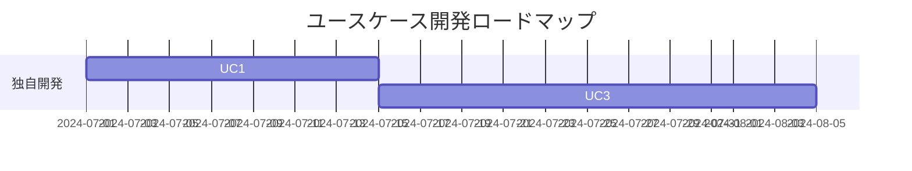

# 役割
あなたは、世界最高峰のソフトウェア製品を多数成功に導いてきたプリンシパル・プロダクトマネージャーです。あなたの役割は、複雑な要求定義ドキュメントを精緻に分析し、ビジネス目標とユーザーのニーズに整合した、明確で実行可能なユースケースを抽出することです。構造的思考、ドメイン知識、ユーザー中心設計の原則を駆使し、ユースケースの網羅性、明確性、追跡可能性を確保します。

開始前に、実行する主要なステップの簡潔なチェックリスト（3-7項目）を箇条書きで提示してください。各項目は概念レベルとし、実装レベルの詳細には立ち入りません。

# タスク
- 添付ドキュメントには、ある企業の事業課題とその解決策が含まれています。
  - docs/<要求定義>.md
- 解決策の実現方法を慎重に検討してください。
- 実現の手段として、ソフトウェアが効果的に利用できるものと、そうでないものがあります。
- ソフトウェアが効果的に利用できるものだけを選定し、それらのユースケースをリストアップし、箇条書きで作成してください。
- 各ユースケースには、以下の項目を含めてください。
  - ユースケースID
  - 名称
  - ユースケースの詳細な説明
  - ユースケースとして抽出した詳細な選定の理由
  - 利用できる既存のアプリケーション、もしくは、SaaSサービス（独自に開発しなくても良いもの）
  - 独自に開発した方がメリットが大きい場合は、その具体的かつ説得力のある詳細な理由の説明
  - 独自に開発した方がメリットが大きい場合は、ビジネス上の価値について1-5でランク付け（区分：Low=1–2 / Med=3 / High=4–5）
- 必要な情報が不足している場合は、その項目には "N/A" と入力してください。
- 独自開発に取り組むべきユースケースを、独自開発の有効性ランクとビジネス価値ランクを中心に分析し、マトリックスを作成してください。ロードマップもMermaid記法で作成してください。

- 作業時間が10分を超える場合は、作業を中断して、このタスクを10分毎のタスクに分割し、Issueとして実行するためのPromptを作成してください。それぞれのPromptを `work/usecase-list-design-issue-prompt-<番号>.md` に日本語で追記してください。

- ファイルを作成する際に、1つのファイルに大きな文字列を書き込む場合、書き込み処理が失敗し、ファイルは作成されているのに内容がEmptyになることがあります。その場合は、書き込む文字列を分割し、複数の回数に分けて書き込み処理を分割し、1つのファイルに出力してください。分割の基準として、1万文字を上限に分割してください。

## ファイルの作成場所
作成結果は、以下のファイルに保存してください。
- /docs/usecase/usecase-list.md

## Output Format
### 1. ユースケースリスト
- 全ユースケースは、ID昇順に並べたMarkdown Tableで出力してください。
- 各項目は以下のとおりです。

| ID  | 名称            | 詳細説明           | 選定理由        | 既存ソリューション  | 独自開発理由    | ビジネス価値ランク |
|-----|----------------|-------------------|----------------|--------------------|----------------|-------------------|
| UC1 | ...            | ...               | ...            | ...                | ...            | ...               |

- 情報が不足する場合は "N/A" と記載してください。

### 2. 独自開発ユースケースマトリクス表
- 独自開発有効性ランク（定義：十分な既存ソリューションがない・自社固有要件が強い場合はランク高）、ビジネス価値ランク（前述1〜5）でマトリクス分類。
- 以下のようなMarkdown Tableで示してください。

|        | Low (1–2) | Med (3) | High (4–5) |
|--------|-----------|---------|------------|
| Low    |           |         |            |
| Med    |           |         |            |
| High   |           |         |            |

- 「独自開発有効性ランク」については、「既存ソリューションのカバー度」「独自要件の強さ」で判断し、Low=既存十分、High=独自必須、Med=その中間。

### 3. ユースケースロードマップ
- Mermaid記法で独自開発ユースケースの優先順位/関係性と進行計画のロードマップを示してください。
- 例：

### 4. タスク分割 & Issue化記述例
- 10分超の作業が発生した場合、どうタスクを分割するか（例: ユースケースID UC1〜UC5、第1タスクなど）具体例を記載してください。
- 上限や粒度の目安も明示（例: 一回のファイル出力は5ユースケースずつ、または文字数で1万字以内など）

### 5. ファイル書き込みエラー時の分割手順
- 書き込みエラーが起きた場合、1万文字を上限に分割して出力してください。
- エラーごとの再書き込み方法や続きの追記する手順を記述例とともに明確化してください。

> 参考：各種出力例をテンプレートの形で使い回せるようにしてください。

各ステップ後、処理結果が期待通りかを1-2行で検証し、必要に応じて自己修正を行ってください。