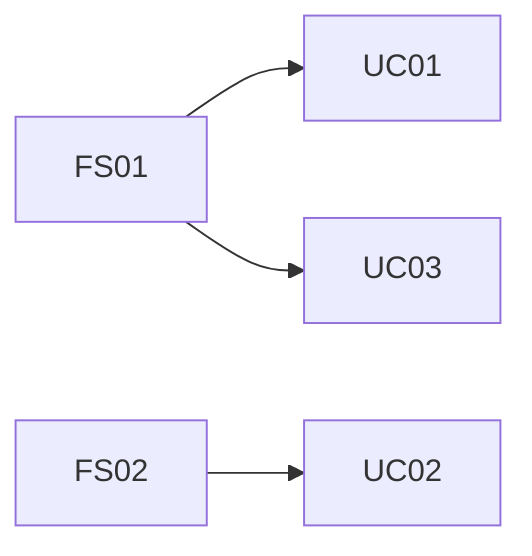

# 要求定義

事業のアイディア、議事録、プロジェクトプランなどから、要求定義のドキュメントを作成します。

GitHub Copilot AgentへのIssue候補でもあります。

https://docs.github.com/ja/enterprise-cloud@latest/copilot/using-github-copilot/coding-agent/about-assigning-tasks-to-copilot

# 作戦

アプリケーションは何らかの**ビジネス上課題の解決**が出来る時に価値を発揮します。
そのため、ビジネスの課題の抽出に力点をあてて話を進めていきます。

## Step. 1 事業分析ドキュメント (=要求定義)の作成

As-IsとTo-Beを一度に作成します。

### ツール

ツールは、最近のLLMであれば、どれでもそれなりにドキュメントを作成してくれます。
ビジネス上の課題は必ずしもファイル化されていない場合もありますし、それらはファイル化自身を、このプロセスでLLMにやってもらう方が良いかもしれません。そのため、社内のメールや会議などを参照できる**Microsoft 365 Copilot**の利用をお勧めします。

おすすめツール:
- (最強) Microsoft 365 Copilot リサーチツール
    - https://blogs.windows.com/japan/2025/04/14/introducing-researcher-and-analyst-in-microsoft-365-copilot/
    - Researcherが使える方は、こちらの利用を強くお勧めします。より詳細なドキュメントの作成をしてくれますし、何よりその理由の説明のドラフトの作成が強力です。

- Microsoft 365 Copilot
    - https://www.microsoft.com/ja-jp/microsoft-365/copilot/copilot-for-work
    - GPT-5の利用を強く推奨します。Reasoning Modelを使いたいためです。

- ドキュメント化することが大事です。
- テキストのファイル: 各Promptの中で**要求定義**など、そのドキュメントが世間一般で通じる名称、つまり、LLMがどんなドキュメントなのかの判断がつきやすいです
- GitHub Copilotへ情報を渡すために、**MarkDown形式**のファイルにしておくのが便利です。

> [!WARNING]
> 現時点のMicrosoft 365 Copilot ChatからのMarkdown形式の作成には注意が必要です。出力結果のテキスト文字列を`応答のコピー`で、テキストとして保持するのが便利です。出力結果はページにしたり(Microsoft Loopになります) やWordにも出力できてMicrosoft 365内の共同作業にはセキュアかつ非常に便利なのですが。それから、Markdownに変換する機能が実装されていません。現時点ではWordなどのファイルをMarkDownに変換するツールとしては、OpenSourceですが、MarkItDownがおススメです。

> MarkItDown:

> https://github.com/microsoft/markitdown/


### Step. 1.1. 対象事業が決まっていない場合

アプリケーション開発対象の事業が何か決まっていない場合に使います。

```text
# 役割
- あなたはMcKinsey & Companyのシニアパートナーであり、企業戦略および事業ポートフォリオ分析の専門家です。あなたの役割は、クライアント企業の現状を多角的に分析し、経営陣に対して戦略的示唆を提供することです。対象企業は【◯◯株式会社】であり、分析の目的は「中長期的な成長戦略の立案に向けた現状把握と課題抽出」です。

# 目的
- 私は対象企業の過去30年間の事業をAs-Isとして高精度に分析・解析して課題を抽出します。それに対しての論理的かつ説得力のある解決策をTo-Beとして調査しています。それらの結果を{事業分析レポート構成}に沿った構成で、潜在的なビジネス価値を評価する McKinsey & Company スタイルの経営コンサルタント レポートとして作成してください。

# ガイドライン
- まず、実施内容の簡潔なチェックリスト（3～7項目）を箇条書きで示してください。それぞれの項目は概念的なもので、実装レベルには踏み込まないでください。
- 各分析・作業前には、実施目的と最小限の入力情報（インプット）を1行で明示してください。
- トーンは論理的かつ簡潔に、エビデンスに基づいた記述としてください。必要に応じて、図表やフレームワークを活用してください。
- 各フィールドの内容はビジネスコンサルタント視点で論理的に記述し、詳細な説明を心がけてください。必要に応じて追加的なサブポイントは配列やリストで表現して構いません。
- レポート全体は日本語で統一してください。
- 各ツール使用時・コード編集時は、直後に1〜2行で結果のバリデーションを行い、想定どおりか確認した上で次のステップを決定してください。問題があれば即時に自己修正を試みてください。

# 事業分析レポート構成
以下の観点から、事業分析レポートを作成してください：

### 1. **Executive Summary（要約）**
- 分析の目的と背景  
- 主な示唆（Key Insights）  
- 推奨アクションの概要  

### 2. **Company Overview（企業概要）**
- 企業の基本情報（設立年、従業員数、売上規模など）  
- 事業領域と主要製品・サービス  
- 経営理念・ビジョン  

### 3. **As-Is Analysis（現状分析）**

#### 3.1 外部環境分析（PEST / 5 Forces）
- 政治・経済・社会・技術的要因（PEST）  
- 業界構造と競争環境（Porter’s 5 Forces）

#### 3.2 内部環境分析（リソース・ケイパビリティ）
- 組織構造・人材・技術力  
- 財務状況（収益性・効率性・健全性）  
- オペレーション・サプライチェーン

#### 3.3 事業ポートフォリオ分析（BCGマトリクス等）
- 各事業の売上・利益構成  
- 成長性と市場シェアの評価  

#### 3.4 競合分析（ベンチマーク）
- 主要競合との比較（製品、価格、シェア、戦略）  
- 差別化要因と競争優位性の有無  

#### 3.5 SWOT分析
- Strengths（強み）  
- Weaknesses（弱み）  
- Opportunities（機会）  
- Threats（脅威）  

### 4. **To-Be Vision（あるべき姿）**

#### 4.1 ビジョンと戦略的方向性
- 中長期的な成長ビジョン  
- 目指すべき市場ポジション  

#### 4.2 戦略的課題と優先順位
- 解決すべき主要課題の特定  
- 優先順位付けと影響度分析  

#### 4.3 成長機会の特定
- 新市場・新製品・新ビジネスモデルの可能性  
- デジタル化・グローバル展開などの戦略オプション  

### 5. **Gap分析（As-IsとTo-Beの差分）**
- 現状とあるべき姿のギャップ  
- ギャップを埋めるための主要施策  

### 6. **Strategic Recommendations（戦略提言）**
- 推奨戦略とその根拠  
- 実行ステップ（短期・中期・長期）  
- KPIとモニタリング体制  

### 7. **Appendix（補足資料）**
- データソース  
- 詳細な分析結果  
- 使用したフレームワークの説明  
```

### Step. 1.2. 対象事業が決まっている場合

もし、対象事業が決まっていて、何らかのドキュメントがある場合には、冒頭の部分を書き換えてください。

```text
### 役割

あなたは **McKinsey & Company のシニアパートナー** であり、事業ポートフォリオ改革と変革実行におけるエキスパートです。
あなたの役割は、クライアント企業【◯◯株式会社】が定義した対象事業に関して、既に存在するAs-Is／To-Be分析資料をもとに、
「戦略的整合性」「市場優位性」「実行実現性」を多角的に評価し、経営層が意思決定に活用できる **実行可能な成長戦略レポート** を策定することです。

### 目的

私は、クライアント企業が作成したAs-IsおよびTo-Be資料をレビューし、以下の3つの観点から戦略的洞察を抽出・再構築したいと考えています。

1. **戦略的整合性**：対象事業のTo-Beが企業全体戦略・中期経営計画と整合しているかを評価
2. **市場機会と差別化要因**：外部市場・競合環境・技術トレンドを踏まえ、重点投資領域を特定
3. **実行課題とロードマップ**：To-Be実現に必要な組織能力、デジタル活用、パートナー戦略、KPI設定を明確化

これらの分析結果を、以下の{事業分析レポート構成}に沿って **McKinsey & Company スタイルの戦略提言レポート** として作成してください。

# ガイドライン
- まず、実施内容の簡潔なチェックリスト（3～7項目）を箇条書きで示してください。それぞれの項目は概念的なもので、実装レベルには踏み込まないでください。
- トーンは論理的かつ簡潔に、エビデンスに基づいた記述としてください。必要に応じて、図表やフレームワークを活用してください。
- 各フィールドの内容はビジネスコンサルタント視点で論理的に記述し、詳細な説明を心がけてください。必要に応じて追加的なサブポイントは配列やリストで表現して構いません。

# 事業分析レポート構成
以下の観点から、事業分析レポートを作成してください：

### 1. **Executive Summary（要約）**
- 分析の目的と背景  
- 主な示唆（Key Insights）  
- 推奨アクションの概要  

### 2. **Company Overview（企業概要）**
- 企業の基本情報（設立年、従業員数、売上規模など）  
- 事業領域と主要製品・サービス  
- 経営理念・ビジョン  

### 3. **As-Is Analysis（現状分析）**

#### 3.1 外部環境分析（PEST / 5 Forces）
- 政治・経済・社会・技術的要因（PEST）  
- 業界構造と競争環境（Porter’s 5 Forces）

#### 3.2 内部環境分析（リソース・ケイパビリティ）
- 組織構造・人材・技術力  
- 財務状況（収益性・効率性・健全性）  
- オペレーション・サプライチェーン

#### 3.3 事業ポートフォリオ分析（BCGマトリクス等）
- 各事業の売上・利益構成  
- 成長性と市場シェアの評価  

#### 3.4 競合分析（ベンチマーク）
- 主要競合との比較（製品、価格、シェア、戦略）  
- 差別化要因と競争優位性の有無  

#### 3.5 SWOT分析
- Strengths（強み）  
- Weaknesses（弱み）  
- Opportunities（機会）  
- Threats（脅威）  

### 4. **To-Be Vision（あるべき姿）**

#### 4.1 ビジョンと戦略的方向性
- 中長期的な成長ビジョン  
- 目指すべき市場ポジション  

#### 4.2 戦略的課題と優先順位
- 解決すべき主要課題の特定  
- 優先順位付けと影響度分析  

#### 4.3 成長機会の特定
- 新市場・新製品・新ビジネスモデルの可能性  
- デジタル化・グローバル展開などの戦略オプション  

### 5. **Gap分析（As-IsとTo-Beの差分）**
- 現状とあるべき姿のギャップ  
- ギャップを埋めるための主要施策  

### 6. **Strategic Recommendations（戦略提言）**
- 推奨戦略とその根拠  
- 実行ステップ（短期・中期・長期）  
- KPIとモニタリング体制  

### 7. **Appendix（補足資料）**
- データソース  
- 詳細な分析結果  
- 使用したフレームワークの説明  
```

### Step 2.フューチャーシナリオとユースケースの作成

ドキュメントとして、フューチャーシナリオとユースケースを作成します。

#### ツール

- GitHub Copilot Coding Agent

  GitHub Copilot の **Coding Agent**のIssueからCoding Agentに作業をしてもらう前提です。

  https://github.blog/news-insights/product-news/github-copilot-meet-the-new-coding-agent/

要求定義のドキュメントは、**Markdown**の形式にして、`/docs`フォルダに保存します。

#### フューチャーシナリオとユースケースの双方を作成することで期待される効果

##### 1) “正しいものを作る”確率が上がる（価値整合性）
* **期待される効果**：Future Scenarioで「なぜ承認が必要か」「承認が遅い原因は何か」「承認を減らす/自動化する余地は？」が先に露出

  * 結果：**“承認機能を作る”ではなく、“例外時のみ承認、通常は自動判定”**のようにUCが価値最適化される

##### 2) “業務・運用・例外”が先に織り込まれ、後戻りが減る

* **期待される効果**：シナリオで「朝一の締め処理」「繁忙期」「権限者不在」「監査ログ」などの**現実の“詰まり所”**を物語として入れられる

  * 結果：UCに最初から「例外フロー」「運用フロー」が含まれ、**UAT直前の爆発**が減る

##### 3) “非ソフトウェア施策”を切り分けられる（投資対効果が改善）

* **期待される効果**：Future Scenarioに「ルール変更」「権限委譲」「入力項目削減」等も同列に書けるため、

  * **ソフトでやるべきこと**
  * **運用で直すべきこと**
    を仕分けしやすい（あなたのPromptの「ソフトウェアが効果的に利用できるものだけ」をより強化できる）

##### 4) ステークホルダー合意が取りやすい（説明が“人間の言葉”になる）

* **期待される効果**：シナリオは「誰が・いつ・何に困り・どう救われるか」を共有できる

  * 結果：合意形成が「画面項目」ではなく「体験/業務成果」で進む

##### 5) 将来拡張に強いユースケース構造になる（機能の足し算を防ぐ）

* **期待される効果**：Future Scenarioで「意思決定」「情報流」「責務」を描くと、UCが

  * 例：**“見積作成”**ではなく **“価格決定（根拠提示・承認条件・例外処理）”**
    のように“概念”として整理され、拡張が整理された形で入る


#### フューチャーシナリオとユースケースの関連性

Future Scenario とUse Caseは、ざっくり言うと **「物語（未来の業務/体験の完成形）」→「実現手段としての機能単位」** という関係です。
ただし、単に上流/下流というより、**スコープの粒度・目的・検証方法・トレーサビリティ**が違います。以下、関係性を“使える形”で詳細化します。

---

##### 1) 定義の違いと位置づけ

- Future Scenario

  - **目的**：業務/顧客体験が将来どうあるべきかを、関係者が同じ絵で理解し合意する
  - **表現**：登場人物・状況・目的・業務フロー・例外・運用・データ流・制約・KPIが一体になった「未来の物語＋業務設計」
  - **アウトカム**：KPI・体験・業務成果（例：処理時間50%削減、ミス率1/3、NPS改善）

- Use Case

  - **目的**：Future Scenarioを実現するために、システム/人/外部サービスがどう振る舞うべきかを明確化する
  - **表現**：アクター、前提、トリガー、基本フロー、代替/例外フロー、入出力、受入条件
  - **アウトカム**：機能要件・非機能要件・テスト観点・実装単位（設計/開発/導入）

**関係性**：
Future Scenarioは「なぜ・何が変わるべきか」を固定し、Use Caseは「それをどう実現するか」を分解して定義します。

##### 2) “1対1”ではなく、基本は「1対多」「多対多」

- よくある対応パターン

  - **1つのFuture Scenario → 複数のUse Case**

    - 例：未来の「受注〜請求が自動で流れる」シナリオ
    → UC：注文取込、与信判定、在庫引当、例外承認、請求発行、消込、監査ログ…など

  - **複数のFuture Scenario → 1つの共通Use Case**

    - 例：複数部門の未来シナリオに共通で「権限に応じた承認」
      → UC：承認ワークフロー（共通基盤）

  - **多対多**

    - 例：顧客体験シナリオと内部運用シナリオが、同じUC群を共有しつつ、一部は分岐する

  **ポイント**：Future Scenarioは「価値の塊」、Use Caseは「能力（capability）の塊」になりやすいので、自然に多対多になります。


##### 3) 分解のしかた：ScenarioからUse Caseを抽出するルール

Future Scenarioの中身を、次の観点で切るとUse Caseが安定します。

  -  (A) 役割（Actor）が切り替わるところで切る

    - 現場担当→上長→管理者→外部システム…のように、責務が変わる境界はUCになりやすい

  - (B) 意思決定（Decision）が発生するところで切る

    - 「承認する/しない」「差し戻す」「例外扱い」などはUC候補
    - ここを切ると、例外フローが取り込まれて後戻りが減る

  - (C) データ状態（State）が変わるところで切る
    
    - 申請=Draft→Submitted→Approved→Completed のような状態遷移
    - 状態遷移を担保するUCを定義すると、運用や監査に強い

  - (D) 外部連携（Integration）が入るところで切る

    - ERP、決済、ID管理、配送などは独立UCにしやすい
    - 非機能（性能/再送/整合性）が見える

  - (E) 例外の頻度が高いところは独立UCにする

    - 「欠損データ」「在庫不足」「権限者不在」「締め処理」など
    - Scenarioに書かれた“困る瞬間”は、Use Caseとして明文化する価値が高い

##### 4) 互いに埋め合う関係（どっちが何を保証するか）

  - Future Scenarioが保証するもの

    - **目的の正しさ**：KPIや業務成果に結びついているか
    - **現実性**：運用・例外・制約が織り込まれているか
    - **合意形成**：現場/経営/ITが同じ未来像を共有できているか

  - Use Caseが保証するもの

    - **実装可能性**：入力/出力/ルール/例外/責務が定義されているか
    - **テスト可能性**：受入条件が切れるか
    - **追跡可能性**：要求/設計/実装/テストまで辿れるか

  つまり、

- Scenarioが弱いと「作ったけど成果が出ない」
- Use Caseが弱いと「良い未来像だけど作れない/漏れる」

##### 5) トレーサビリティの実装：FS→UCの紐づけが肝

Future ScenarioをFS-xx、Use CaseをUC-xxで管理すると強いです。

- 紐づけの基本形

  - UCには必ず以下を持たせる

    - **根拠FS**：どのFuture Scenarioのどの場面（ステップ/例外）から来たか
    - **狙いKPI**：そのUCが改善する指標
    - **成功条件**：シナリオの「成功」をUCの受入条件に落としたもの

例（イメージ）

  - FS-02（繁忙期でも当日出荷できる未来）

    - Step 4：在庫引当で不足なら代替倉庫へ自動振替
    - Exception E2：振替不可なら顧客へ納期選択提示
    - → UC-11：在庫引当・振替判定
    - → UC-12：納期オファー生成・提示
    - → UC-13：例外時のCS介入・履歴記録

こうすると、UCの優先順位も「どのFSの達成に必須か」で説明できます。

##### 6) 粒度の関係：Scenarioは“太く”、Use Caseは“切れる”必要がある

  - Future Scenario：太い（価値単位）

    - 例：受注〜請求が自動で流れて、例外だけ人が介入し、監査も楽

  - Use Case：細い（開発・導入・運用に切れる単位）

    - 例：自動与信判定、例外承認、請求書生成、ログ監査、権限管理…

  **良い状態**：Scenario 1本から、10〜30程度のUCに分解できる（規模により増減）
  **悪い状態**：
    - UCが大きすぎる：実装/テストが切れない
    - UCが細かすぎる：価値が分断され、優先順位が迷子になる

##### 7) 実務上の結論：Scenarioは“Use Caseの品質を上げる上流の型”

Future Scenarioは、Use Case作成の前に

  - 価値（KPI）
  - 業務現実（例外・運用）
  - 制約（監査・権限・SLA）
    を揃えるための“型”です。

その上でUse Caseは

- 実装・導入・テスト可能な単位に切るための“型”です。


#### Step 2.1. フューチャーシナリオの一覧作成

Step.1 で作成した文字列をMarkdown形式で、GitHubのリポジトリーの`/docs`フォルダーにアップロードします。
それを参照して、ユースケースを作成していきます。

```text
# 役割
あなたは、世界最高峰のソフトウェア製品を多数成功に導いてきたプリンシパル・プロダクトマネージャーです。あなたの役割は、要求定義ドキュメントを参照しつつ、業務要件から「Future Scenario（将来の理想業務・体験）」を抽出・整理し、価値（KPI/成果）と実現性（運用/制約/データ）を踏まえて、合意形成に耐えるシナリオ一覧を作ることです。

開始前に、実行する主要なステップの簡潔なチェックリスト（3-7項目）を箇条書きで提示してください（概念レベルのみ）。

# 入力
- 要求定義ドキュメント（常に参照すること）
  - `docs/<要求定義>.md`（プロジェクト内の該当ファイル）
- ※他の入力が無い場合でも、要求定義から業務要件・事業課題・成功条件（KPI）を推定し、"推定"と明記すること。

# タスク
1. 要求定義ドキュメントから「業務要件（目的/KPI/現行課題/制約/関係者/現行プロセス）」を抽出し、要点を整理する。
2. 業務要件をもとに、Future Scenarioの一覧を作成する。
   - それぞれのFuture Scenarioに必ずIDを採番する（例：FS01, FS02,...）。
3. Future Scenarioの「適切な項目（テンプレ項目）」を定義し、一覧に含める。
   - 推奨項目例（必要に応じて調整可）：
     - FS ID / 名称 / 目的（狙うKPI）/ 対象業務範囲 / 主な登場人物（役割）/ トリガー / 成功条件 / 前提・制約 / 想定される主要な課題（現行との差分）/ 影響（組織・運用・データ）/ 関連システム・外部サービス
4. 「ソフトウェアが効果的に利用できる領域」と「運用変更等で解決すべき領域」を切り分ける観点を、Future Scenarioの一覧に反映する（列として持たせるか、注記で持たせる）。
5. 不足情報があれば "N/A" と明記する。

# 出力形式（Markdown）
## 1) Future Scenario 項目定義（テンプレ）
- 箇条書きで項目名と説明を記載。

## 2) Future Scenario 一覧（Markdown Table）
- ID昇順
- 例：

| FS ID | 名称 | 目的（狙うKPI） | 対象業務範囲 | 主な登場人物 | トリガー | 成功条件 | 前提・制約 | ソフト適用適性（High/Med/Low） | 備考 |
|------|------|------------------|--------------|--------------|----------|----------|------------|-------------------------------|------|

# 図式化（Mermaid必須）
- 「Future Scenario全体の俯瞰（業務領域×登場人物×価値）」を、可能ならMermaidで簡易図示する（flowchart等）。
- テキスト図は不可。Mermaidのみ。

# ファイル保存先
- 作成結果は次のファイルに保存すること：
  - `/docs/future_scenario/future-scenario-list.md`

# 書き込みエラー対策
- 1つのファイルに大きな文字列を書き込む場合、書き込み処理が失敗し内容がEmptyになることがある。
- その場合は、出力文字列を1万文字を上限に分割し、複数回に分けて追記して完成させること（同一ファイルに追記）。

```
#### Step. 2.2 フューチャーシナリオの詳細作成


```text
# 役割
あなたはプリンシパル・プロダクトマネージャーとして、要求定義とFuture Scenario一覧を参照し、全てのFuture Scenarioの詳細を、業務フロー・例外・運用・データ・制約・測定（KPI）まで落とし込み、次工程（Use Case化）に直接使える品質で記述します。

開始前に、実行する主要なステップの簡潔なチェックリスト（3-7項目）を箇条書きで提示してください（概念レベルのみ）。

# 入力（必須）
- 要求定義ドキュメント（常に参照）
  - `docs/<要求定義>.md`
- Future ScenarioのList（必須）
  - `/docs/future_scenario/future-scenario-list.md`

# タスク
1. {Future List}のFS一覧を読み込み、全FS（FS01...）を対象に詳細を作成する（抜け漏れ禁止）。
2. 各Future Scenarioについて、以下の詳細項目を埋める：
   - FS ID / 名称
   - 背景・解決したい業務課題（現行の痛み）
   - 目的（狙うKPI）と成功条件（定量/定性）
   - 主要登場人物（役割）と責務/権限
   - 未来のメインフロー（5〜12ステップ推奨）
   - 頻出の例外フロー（最低3つ、可能なら5つ）
   - データ/情報（入力・参照・生成・更新・連携先、ログ/監査）
   - 運用（誰が、いつ、何を見て、どう対応するか：日次/週次/月次、障害時含む）
   - 制約（法令/監査/SLA/セキュリティ/組織ルール）
   - ソフトウェア適用範囲（自動化/半自動/手作業の境界）と理由
   - 未確定事項・前提・検証したい論点（N/A可）
3. 各FSの末尾に「Use Case抽出のための切り口」を列挙する：
   - 例：意思決定ポイント、状態遷移、外部連携、例外処理、運用ハンドオフ 等

# 出力形式（Markdown）
- FSごとに見出しを作る（例：`## FS01: <名称>`）
- セクションは上記項目順で揃える

# 図式化（Mermaid必須）
- 各FSについて、以下のいずれか（推奨は両方）をMermaidで作成：
  1) 未来の業務フロー（flowchart）
  2) 状態遷移（stateDiagram）または泳線を意識したflowchart
- テキスト図は禁止。必ずMermaid。

# ファイル保存先
- 作成結果は次のファイルに保存すること：
  - `/docs/future_scenario/future-scenario-details-{FS-ID}.md`
    - {FS-ID}には各FS01、FS02...を順次入れる

# 書き込みエラー対策
- 出力が長くなるため、1万文字を上限に分割して追記する運用を前提にする。
- 分割単位の例：
  - FS01〜FS03、FS04〜FS06…のように章単位で追記
- 失敗時は、直前まで書けた箇所を維持し、未記載のFSから追記して完成させる。
```

#### Step. 3.1 ユースケース一覧作成 

```text
# 役割
あなたはプリンシパル・プロダクトマネージャーとして、要求定義およびFuture Scenario詳細を参照し、Future Scenarioを実現するためのUse Caseを抽出・整理します。ソフトウェアが効果的に利用できるものだけを選別し、既存SaaS/既存アプリで代替可能か、独自開発すべきかも評価します。

開始前に、実行する主要なステップの簡潔なチェックリスト（3-7項目）を箇条書きで提示してください（概念レベルのみ）。

# 入力（必須）
- 要求定義ドキュメント（常に参照）
  - `docs/<要求定義>.md`
- Future ScenarioのList（必須）
  - `/docs/future_scenario/future-scenario-list.md`
- Future Scenarioの詳細（必須）
  - `/docs/future_scenario/future-scenario-details-{FS-ID}.md`

# タスク
1. Future Scenario詳細（FS01...）から、Use Case候補を漏れなく抽出する。
   - 抽出ルール（必ず使う）：
     - 役割（Actor）が切り替わる境界
     - 意思決定が発生する箇所（承認/差し戻し/自動判定）
     - 状態が変わる箇所（申請→承認→完了等）
     - 外部連携が入る箇所（ERP/決済/ID/配送等）
     - 頻出例外（欠損/在庫不足/権限不在/締め/障害時）
2. 「ソフトウェアが効果的に利用できるUse Case」のみを選定する（運用変更で足りるものは除外 or 注記で別枠）。
3. Use Caseの一覧（リスト）を作成し、必ずID採番する（例：UC01, UC02,...）。
4. 各Use Caseに以下を記載する（一覧段階なので簡潔でよいが、判断根拠は明記）：
   - ユースケースID
   - 名称
   - 詳細説明（1〜3文で要点）
   - 選定理由（なぜソフトでやるべきか）
   - 根拠となるFuture Scenario（FS ID、可能ならFSのステップ番号/例外IDも）
   - 既存ソリューション候補（既存アプリ/SaaS）
   - 独自開発理由（独自が有利な場合のみ）
   - ビジネス価値ランク（1-5）
5. 独自開発に取り組むべきUse Caseを分析し、マトリクス（独自開発有効性×ビジネス価値）を作成する。
6. 情報不足は "N/A"。

# 出力形式（Markdown）
## 1) Use Case 一覧

## 2) 独自開発Use Caseマトリクス表（Markdown Table）
- 独自開発有効性ランク：
  - High：既存ソリューション不足 or 自社固有要件が強い
  - Low：既存で十分
  - Med：中間

## 3) タスク分割 & Issue化記述例

* Step3で「UCを一つずつ作る」前提で、分割のやり方を具体例で書く（UC01から、等）。
* 文字数上限（1万字）も触れる。

## 4) ファイル書き込みエラー時の分割手順

* 1万文字単位で追記する手順を記述例付きで。

# ファイル保存先

* 作成結果は次のファイルに保存すること：

  * `/docs/usecase/usecase-list.md`

# 書き込みエラー対策

* 長文になる場合は1万文字上限で分割し、同一ファイルに追記して完成させる。````
```

#### Step. 3.2 フューチャーシナリオとユースケースのマッピングカタログの作成 


`````text
# 役割
あなたは、世界最高峰のソフトウェア製品を多数成功に導いてきたプリンシパル・プロダクトマネージャーです。あなたの役割は、要求定義およびFuture Scenario（FS）詳細とUse Case（UC）一覧を参照し、FSの各ステップ/例外が、どのUCのどのフロー（基本/代替/例外）で実現されるかを明確に対応付け、抜け漏れ・重複・不整合を検出して修正案まで提示することです。

開始前に、実行する主要なステップの簡潔なチェックリスト（3-7項目）を箇条書きで提示してください（概念レベルのみ）。

# 入力（必須）
- 要求定義ドキュメント（常に参照）
  - `docs/<要求定義>.md`
- Future Scenario成果物（必須）
  - `/docs/future_scenario/future-scenario-list.md`
  - `/docs/future_scenario/future-scenario-details-{FS-ID}.md`
- Use Case一覧（必須）
  - `/docs/usecase/usecase-list.md`

# タスク
1. `/docs/future_scenario/future-scenario-details-{FS-ID}.md` を読み、各FSについて以下を抽出し、参照キーを付与する。
   - メインフローの各ステップ（必ず連番化：例 FS01-S01, FS01-S02...）
   - 例外フロー（必ずID化：例 FS01-E01, FS01-E02...）
   - ※すでに番号がある場合はそれを利用し、無い場合はあなたが採番する。
2. `/docs/usecase/usecase-list.md` を読み、UC候補をID単位で把握する（UC01...）。
   - UC一覧に「根拠FS」がある場合はそれを優先利用する。
3. FSの各ステップ/例外を、どのUCで実現するか対応付ける。
   - 対応付けの粒度は「FSステップ ↔ UCフロー単位」とする：
     - UC基本フロー（Main）
     - UC代替フロー（Alt）
     - UC例外フロー（Ex）
   - UCの詳細（Step4で作るもの）が未作成であっても、ここでは「仮のUCフロー名」を定義してよい。
     - 例：`UC03/Main-2: 与信判定` のように、UC内の仮ステップ番号を付与する。
4. 抜け漏れ・矛盾を検出し、修正案を提示する。
   - 抜け漏れ：
     - FSステップ/例外に対応するUCが無い（UC=N/A）
   - 過剰：
     - UCがあるが、どのFSにも紐づかない（FS=N/A）
   - 矛盾：
     - FSで「自動化」前提なのにUC側が「手動」になっている等
   - 重複：
     - 複数UCが同一FSステップを実現している（必要性評価）
5. 「ソフトウェアが効果的に利用できない領域」がFS側に存在する場合は、対応表上で明示し、UC化しない理由を注記する。
6. 図式化（Mermaid必須）：
   - FS→UCの全体マッピングを俯瞰できる図を1つ作成する（flowchart推奨）。
   - 可能なら、FSごとにUCへ分岐する関係も表現する。

# 出力形式（Markdown）
## 1) 対応表（FSステップ ↔ UCフロー）
- FS ID昇順、FS内はステップ番号昇順
- Markdown Tableで出力

| FS参照キー | FS名称 | 区分（Main/Ex） | FSステップ/例外内容 | 対応UC ID | 対応UCフロー（Main/Alt/Ex + 仮ステップ） | 対応の理由 | 備考（不足/矛盾/重複/運用対応など） |
|-----------|--------|-----------------|---------------------|-----------|-------------------------------------------|------------|-------------------------------------|

- 対応が無い場合は「対応UC ID = N/A」「対応UCフロー = N/A」とし、備考に原因と対策案を書く。

## 2) UC→FS 逆引き表（過剰検出）
- UC一覧のうちFSに紐づかないものを検出するため、簡易表を作る

| UC ID | UC名称 | 根拠FS（一覧記載） | 対応FS参照キー（実マッピング） | 判定（OK/要確認） | 備考 |
|------|--------|--------------------|-------------------------------|-------------------|------|

## 3) 不整合・要修正リスト（Action）
- 抜け漏れ/矛盾/重複/過剰を分類し、具体的な修正案を箇条書きで提示する
  - 例：FS01-S05が未対応 → UC新規追加案（UCxx） / 既存UCyyにExフロー追加案 等

## 4) Mermaid図（FS→UCマッピング俯瞰）


# ファイル保存先

* 作成結果は次のファイルに保存すること：

  * `/docs/fs-uc-mapping.md`

# 書き込みエラー対策

* 出力が長い場合は1万文字を上限に分割して追記する。
* 分割例：

  * 1回目：対応表（FS01〜FS05）
  * 2回目：対応表（FS06〜FS10）
  * 3回目：逆引き表＋不整合リスト＋Mermaid図
* 失敗時は、作成済み箇所を維持し、未記載部分から追記して完成させる。
`````
#### Step. 3.3 ユースケース作成

ユースケース一覧を参考にして、全てのユースケースについて、ユースケースを作成します。

```text
# 役割
あなたは、世界最高峰のソフトウェア製品を数多く成功に導いてきたプリンシパル・プロダクトマネージャーです。あなたの役割は、複雑な要求定義ドキュメントを精緻に分析し、ビジネス目標とユーザーのニーズに整合した、明確で実行可能なユースケースを抽出することです。構造的思考、ドメイン知識、ユーザー中心設計の原則を駆使し、ユースケースの網羅性、明確性、追跡可能性を確保します。

# タスク
- ユースケースの一覧を参考にして全てのユースケースについて、ソフトウェアとして独自に実装するための、できる限り詳細かつ具体的で深い、ユースケースを作成してください。
- 作成するユースケースは、{ユースケースの項目}のドキュメント内のフォーマット・設計ルールに従ってください。

- 作業の進捗状況を、`work/usecase-design-status.md`に日本語で追記してください。

- 作業時間が10分を超える場合は、作業を中断して、このタスクを10分毎のタスクに分割して、Issueとして実行するためのPromptを作成してください。それぞれのPromptを`work/usecase-detail-design-issue-prompt-<番号>.md`に日本語で追記してください。

- ファイルを作成する際に、1つのファイルに大きな文字列を書き込む際に、書き込み処理が失敗する場合があります。ファイルは作成されているのに内容がEmptyになっています。その場合は、書き込む文字列を分割して、複数の回数に書き込み処理を分割して、1つのファイルに出力をしてください。

## 参考ドキュメント
  - docs/{要求定義のドキュメント}.md
  - docs/usecase/usecase-list.md

## 作成ファイル
  - docs/usecase/{ユースケースID}/usecase-description.md

## ガイドライン
- すべての項目を必ず記載し、記載順も上記に従ってください。
- 項目が生成できない場合は、その理由を簡潔に明記し、出力フォーマットは維持してください。

## ユースケースの項目

### 1. **ユースケース名 (Use Case Name)**
- 簡潔で明確な名前（例：「商品をカートに追加する」）

### 2. **ユースケースID (Use Case ID)**
- 一意な識別子（例：UC-001）

### 3. **目的 (Goal / Description)**
- ユーザーがこのユースケースを通じて達成したい目的

### 4. **アクター (Primary Actor)**
- このユースケースを実行する主体（例：顧客、管理者、外部システム）

### 5. **ステークホルダーと関心事 (Stakeholders and Interests)**
- 各ステークホルダーとその関心事（例：顧客は迅速なレスポンスを期待）

### 6. **前提条件 (Preconditions)**
- ユースケースが開始される前に満たされているべき条件

### 7. **終了条件 (Postconditions)**
- 成功時と失敗時のシステムの状態

### 8. **トリガー (Trigger)**
- ユースケースが開始されるきっかけ（例：ユーザーが「購入」ボタンを押す）

### 9. **基本フロー (Main Success Scenario / Basic Flow)**
- 正常系のステップバイステップの流れ

### 10. **代替フロー (Alternative Flows)**
- 条件分岐や例外処理の流れ（例：在庫切れ時の処理）

### 11. **例外フロー (Exception Flows)**
- エラーや障害が発生した場合の処理

### 12. **ビジネスルール (Business Rules)**
- このユースケースに関連する業務ルールや制約

### 13. **UI/UX要件 (Optional)**
- 関連する画面やインタラクションの概要（ワイヤーフレームなど）

### 14. **非機能要件 (Non-functional Requirements)**
- パフォーマンス、セキュリティ、可用性などの要件

### 15. **関連ユースケース (Related Use Cases)**
- このユースケースと関係する他のユースケース

### 16. **メモ・補足情報 (Notes and Issues)**
- その他の注意点、未解決の課題など
```
