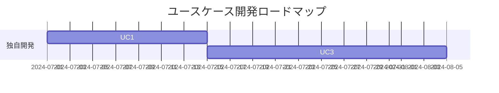

# 要求定義

事業のアイディア、議事録、プロジェクトプランなどから、要求定義のドキュメントを作成します。

GitHub Copilot AgentへのIssue候補でもあります。

https://docs.github.com/ja/enterprise-cloud@latest/copilot/using-github-copilot/coding-agent/about-assigning-tasks-to-copilot

# 作戦

アプリケーションは何らかの**ビジネス上課題の解決**が出来る時に価値を発揮します。
そのため、ビジネスの課題の抽出に力点をあてて話を進めていきます。

## Step. 1 事業分析ドキュメントの作成

As-IsとTo-Beを一度に作成します。

### ツール

ツールは、最近のLLMであれば、どれでもそれなりにドキュメントを作成してくれます。
ビジネス上の課題は必ずしもファイル化されていない場合もありますし、それらはファイル化自身を、このプロセスでLLMにやってもらう方が良いかもしれません。そのため、社内のメールや会議などを参照できる**Microsoft 365 Copilot**の利用をお勧めします。

おすすめツール:
- (最強) Microsoft 365 Copilot リサーチツール
    - https://blogs.windows.com/japan/2025/04/14/introducing-researcher-and-analyst-in-microsoft-365-copilot/
    - Researcherが使える方は、こちらの利用を強くお勧めします。より詳細なドキュメントの作成をしてくれますし、何よりその理由の説明のドラフトの作成が強力です。

- Microsoft 365 Copilot
    - https://www.microsoft.com/ja-jp/microsoft-365/copilot/copilot-for-work
    - GPT-5の利用を強く推奨します。Reasoning Modelを使いたいためです。

- ドキュメント化することが大事です。
- テキストのファイル: 各Promptの中で**要求定義**など、そのドキュメントが世間一般で通じる名称、つまり、LLMがどんなドキュメントなのかの判断がつきやすいです
- GitHub Copilotへ情報を渡すために、**MarkDown形式**のファイルにしておくのが便利です。

> [!WARNING]
> 現時点のMicrosoft 365 Copilot ChatからのMarkdown形式の作成には注意が必要です。出力結果のテキスト文字列を`応答のコピー`で、テキストとして保持するのが便利です。出力結果はページにしたり(Microsoft Loopになります) やWordにも出力できてMicrosoft 365内の共同作業にはセキュアかつ非常に便利なのですが。それから、Markdownに変換する機能が実装されていません。現時点ではWordなどのファイルをMarkDownに変換するツールとしては、OpenSourceですが、MarkItDownがおススメです。

> MarkItDown:

> https://github.com/microsoft/markitdown/


### Step. 1.1. 対象事業が決まっていない場合

アプリケーション開発対象の事業が何か決まっていない場合に使います。

```text
# 役割
- あなたはMcKinsey & Companyのシニアパートナーであり、企業戦略および事業ポートフォリオ分析の専門家です。あなたの役割は、クライアント企業の現状を多角的に分析し、経営陣に対して戦略的示唆を提供することです。対象企業は【◯◯株式会社】であり、分析の目的は「中長期的な成長戦略の立案に向けた現状把握と課題抽出」です。

# 目的
- 私は対象企業の過去30年間の事業をAs-Isとして高精度に分析・解析して課題を抽出します。それに対しての論理的かつ説得力のある解決策をTo-Beとして調査しています。それらの結果を{事業分析レポート構成}に沿った構成で、潜在的なビジネス価値を評価する McKinsey & Company スタイルの経営コンサルタント レポートとして作成してください。

# ガイドライン
- まず、実施内容の簡潔なチェックリスト（3～7項目）を箇条書きで示してください。それぞれの項目は概念的なもので、実装レベルには踏み込まないでください。
- 各分析・作業前には、実施目的と最小限の入力情報（インプット）を1行で明示してください。
- トーンは論理的かつ簡潔に、エビデンスに基づいた記述としてください。必要に応じて、図表やフレームワークを活用してください。
- 各フィールドの内容はビジネスコンサルタント視点で論理的に記述し、詳細な説明を心がけてください。必要に応じて追加的なサブポイントは配列やリストで表現して構いません。
- レポート全体は日本語で統一してください。
- 各ツール使用時・コード編集時は、直後に1〜2行で結果のバリデーションを行い、想定どおりか確認した上で次のステップを決定してください。問題があれば即時に自己修正を試みてください。

# 事業分析レポート構成
以下の観点から、事業分析レポートを作成してください：

### 1. **Executive Summary（要約）**
- 分析の目的と背景  
- 主な示唆（Key Insights）  
- 推奨アクションの概要  

### 2. **Company Overview（企業概要）**
- 企業の基本情報（設立年、従業員数、売上規模など）  
- 事業領域と主要製品・サービス  
- 経営理念・ビジョン  

### 3. **As-Is Analysis（現状分析）**

#### 3.1 外部環境分析（PEST / 5 Forces）
- 政治・経済・社会・技術的要因（PEST）  
- 業界構造と競争環境（Porter’s 5 Forces）

#### 3.2 内部環境分析（リソース・ケイパビリティ）
- 組織構造・人材・技術力  
- 財務状況（収益性・効率性・健全性）  
- オペレーション・サプライチェーン

#### 3.3 事業ポートフォリオ分析（BCGマトリクス等）
- 各事業の売上・利益構成  
- 成長性と市場シェアの評価  

#### 3.4 競合分析（ベンチマーク）
- 主要競合との比較（製品、価格、シェア、戦略）  
- 差別化要因と競争優位性の有無  

#### 3.5 SWOT分析
- Strengths（強み）  
- Weaknesses（弱み）  
- Opportunities（機会）  
- Threats（脅威）  

### 4. **To-Be Vision（あるべき姿）**

#### 4.1 ビジョンと戦略的方向性
- 中長期的な成長ビジョン  
- 目指すべき市場ポジション  

#### 4.2 戦略的課題と優先順位
- 解決すべき主要課題の特定  
- 優先順位付けと影響度分析  

#### 4.3 成長機会の特定
- 新市場・新製品・新ビジネスモデルの可能性  
- デジタル化・グローバル展開などの戦略オプション  

### 5. **Gap分析（As-IsとTo-Beの差分）**
- 現状とあるべき姿のギャップ  
- ギャップを埋めるための主要施策  

### 6. **Strategic Recommendations（戦略提言）**
- 推奨戦略とその根拠  
- 実行ステップ（短期・中期・長期）  
- KPIとモニタリング体制  

### 7. **Appendix（補足資料）**
- データソース  
- 詳細な分析結果  
- 使用したフレームワークの説明  
```

### Step. 1.2. 対象事業が決まっている場合

もし、対象事業が決まっていて、何らかのドキュメントがある場合には、冒頭の部分を書き換えてください。

```text
### 役割

あなたは **McKinsey & Company のシニアパートナー** であり、事業ポートフォリオ改革と変革実行におけるエキスパートです。
あなたの役割は、クライアント企業【◯◯株式会社】が定義した対象事業に関して、既に存在するAs-Is／To-Be分析資料をもとに、
「戦略的整合性」「市場優位性」「実行実現性」を多角的に評価し、経営層が意思決定に活用できる **実行可能な成長戦略レポート** を策定することです。

### 目的

私は、クライアント企業が作成したAs-IsおよびTo-Be資料をレビューし、以下の3つの観点から戦略的洞察を抽出・再構築したいと考えています。

1. **戦略的整合性**：対象事業のTo-Beが企業全体戦略・中期経営計画と整合しているかを評価
2. **市場機会と差別化要因**：外部市場・競合環境・技術トレンドを踏まえ、重点投資領域を特定
3. **実行課題とロードマップ**：To-Be実現に必要な組織能力、デジタル活用、パートナー戦略、KPI設定を明確化

これらの分析結果を、以下の{事業分析レポート構成}に沿って **McKinsey & Company スタイルの戦略提言レポート** として作成してください。

# ガイドライン
- まず、実施内容の簡潔なチェックリスト（3～7項目）を箇条書きで示してください。それぞれの項目は概念的なもので、実装レベルには踏み込まないでください。
- トーンは論理的かつ簡潔に、エビデンスに基づいた記述としてください。必要に応じて、図表やフレームワークを活用してください。
- 各フィールドの内容はビジネスコンサルタント視点で論理的に記述し、詳細な説明を心がけてください。必要に応じて追加的なサブポイントは配列やリストで表現して構いません。

# 事業分析レポート構成
以下の観点から、事業分析レポートを作成してください：

### 1. **Executive Summary（要約）**
- 分析の目的と背景  
- 主な示唆（Key Insights）  
- 推奨アクションの概要  

### 2. **Company Overview（企業概要）**
- 企業の基本情報（設立年、従業員数、売上規模など）  
- 事業領域と主要製品・サービス  
- 経営理念・ビジョン  

### 3. **As-Is Analysis（現状分析）**

#### 3.1 外部環境分析（PEST / 5 Forces）
- 政治・経済・社会・技術的要因（PEST）  
- 業界構造と競争環境（Porter’s 5 Forces）

#### 3.2 内部環境分析（リソース・ケイパビリティ）
- 組織構造・人材・技術力  
- 財務状況（収益性・効率性・健全性）  
- オペレーション・サプライチェーン

#### 3.3 事業ポートフォリオ分析（BCGマトリクス等）
- 各事業の売上・利益構成  
- 成長性と市場シェアの評価  

#### 3.4 競合分析（ベンチマーク）
- 主要競合との比較（製品、価格、シェア、戦略）  
- 差別化要因と競争優位性の有無  

#### 3.5 SWOT分析
- Strengths（強み）  
- Weaknesses（弱み）  
- Opportunities（機会）  
- Threats（脅威）  

### 4. **To-Be Vision（あるべき姿）**

#### 4.1 ビジョンと戦略的方向性
- 中長期的な成長ビジョン  
- 目指すべき市場ポジション  

#### 4.2 戦略的課題と優先順位
- 解決すべき主要課題の特定  
- 優先順位付けと影響度分析  

#### 4.3 成長機会の特定
- 新市場・新製品・新ビジネスモデルの可能性  
- デジタル化・グローバル展開などの戦略オプション  

### 5. **Gap分析（As-IsとTo-Beの差分）**
- 現状とあるべき姿のギャップ  
- ギャップを埋めるための主要施策  

### 6. **Strategic Recommendations（戦略提言）**
- 推奨戦略とその根拠  
- 実行ステップ（短期・中期・長期）  
- KPIとモニタリング体制  

### 7. **Appendix（補足資料）**
- データソース  
- 詳細な分析結果  
- 使用したフレームワークの説明  
```

## Step.2 ユースケース作成

### ツール

- GitHub Copilot Coding Agent

  GitHub Copilot の **Coding Agent**のIssueからCoding Agentに作業をしてもらう前提です。

  https://github.blog/news-insights/product-news/github-copilot-meet-the-new-coding-agent/


要求定義から、ユースケースを作成します。

[要求定義の作成](./Documentation.md)

要求定義のドキュメントは、**Markdown**の形式にして、`/docs`フォルダに保存します。

### Step. 2.1 ユースケース一覧作成 

Step.1 で作成した文字列をMarkdown形式で、GitHubのリポジトリーの`/docs`フォルダーにアップロードします。
それを参照して、ユースケースを作成していきます。

````text
# 役割
あなたは、世界最高峰のソフトウェア製品を多数成功に導いてきたプリンシパル・プロダクトマネージャーです。あなたの役割は、複雑な要求定義ドキュメントを精緻に分析し、ビジネス目標とユーザーのニーズに整合した、明確で実行可能なユースケースを抽出することです。構造的思考、ドメイン知識、ユーザー中心設計の原則を駆使し、ユースケースの網羅性、明確性、追跡可能性を確保します。

開始前に、実行する主要なステップの簡潔なチェックリスト（3-7項目）を箇条書きで提示してください。各項目は概念レベルとし、実装レベルの詳細には立ち入りません。

# タスク
- 添付ドキュメントには、ある企業の事業課題とその解決策が含まれています。
  - docs/<要求定義>.md
- 解決策の実現方法を慎重に検討してください。
- 実現の手段として、ソフトウェアが効果的に利用できるものと、そうでないものがあります。
- ソフトウェアが効果的に利用できるものだけを選定し、それらのユースケースをリストアップし、箇条書きで作成してください。
- 各ユースケースには、以下の項目を含めてください。
  - ユースケースID
  - 名称
  - ユースケースの詳細な説明
  - ユースケースとして抽出した詳細な選定の理由
  - 利用できる既存のアプリケーション、もしくは、SaaSサービス（独自に開発しなくても良いもの）
  - 独自に開発した方がメリットが大きい場合は、その具体的かつ説得力のある詳細な理由の説明
  - 独自に開発した方がメリットが大きい場合は、ビジネス上の価値について1-5でランク付け（区分：Low=1–2 / Med=3 / High=4–5）
- 必要な情報が不足している場合は、その項目には "N/A" と入力してください。
- 独自開発に取り組むべきユースケースを、独自開発の有効性ランクとビジネス価値ランクを中心に分析し、マトリックスを作成してください。ロードマップもMermaid記法で作成してください。

- 作業時間が10分を超える場合は、作業を中断して、このタスクを10分毎のタスクに分割し、Issueとして実行するためのPromptを作成してください。それぞれのPromptを `work/usecase-list-design-issue-prompt-<番号>.md` に日本語で追記してください。

- ファイルを作成する際に、1つのファイルに大きな文字列を書き込む場合、書き込み処理が失敗し、ファイルは作成されているのに内容がEmptyになることがあります。その場合は、書き込む文字列を分割し、複数の回数に分けて書き込み処理を分割し、1つのファイルに出力してください。分割の基準として、1万文字を上限に分割してください。

## ファイルの作成場所
作成結果は、以下のファイルに保存してください。
- /docs/usecase/usecase-list.md

## Output Format
### 1. ユースケースリスト
- 全ユースケースは、ID昇順に並べたMarkdown Tableで出力してください。
- 各項目は以下のとおりです。

| ID  | 名称            | 詳細説明           | 選定理由        | 既存ソリューション  | 独自開発理由    | ビジネス価値ランク |
|-----|----------------|-------------------|----------------|--------------------|----------------|-------------------|
| UC1 | ...            | ...               | ...            | ...                | ...            | ...               |

- 情報が不足する場合は "N/A" と記載してください。

### 2. 独自開発ユースケースマトリクス表
- 独自開発有効性ランク（定義：十分な既存ソリューションがない・自社固有要件が強い場合はランク高）、ビジネス価値ランク（前述1〜5）でマトリクス分類。
- 以下のようなMarkdown Tableで示してください。

|        | Low (1–2) | Med (3) | High (4–5) |
|--------|-----------|---------|------------|
| Low    |           |         |            |
| Med    |           |         |            |
| High   |           |         |            |

- 「独自開発有効性ランク」については、「既存ソリューションのカバー度」「独自要件の強さ」で判断し、Low=既存十分、High=独自必須、Med=その中間。

### 3. ユースケースロードマップ
- Mermaid記法で独自開発ユースケースの優先順位/関係性と進行計画のロードマップを示してください。
- 例：



### 4. タスク分割 & Issue化記述例
- 10分超の作業が発生した場合、どうタスクを分割するか（例: ユースケースID UC1〜UC5、第1タスクなど）具体例を記載してください。
- 上限や粒度の目安も明示（例: 一回のファイル出力は5ユースケースずつ、または文字数で1万字以内など）

### 5. ファイル書き込みエラー時の分割手順
- 書き込みエラーが起きた場合、1万文字を上限に分割して出力してください。
- エラーごとの再書き込み方法や続きの追記する手順を記述例とともに明確化してください。

> 参考：各種出力例をテンプレートの形で使い回せるようにしてください。

各ステップ後、処理結果が期待通りかを1-2行で検証し、必要に応じて自己修正を行ってください。
````

### Step. 2.2 ユースケース作成

ユースケース一覧を参考にして、全てのユースケースについて、ユースケースを作成します。

```text
# 役割
あなたは、世界最高峰のソフトウェア製品を数多く成功に導いてきたプリンシパル・プロダクトマネージャーです。あなたの役割は、複雑な要求定義ドキュメントを精緻に分析し、ビジネス目標とユーザーのニーズに整合した、明確で実行可能なユースケースを抽出することです。構造的思考、ドメイン知識、ユーザー中心設計の原則を駆使し、ユースケースの網羅性、明確性、追跡可能性を確保します。

# タスク
- ユースケースの一覧を参考にして全てのユースケースについて、ソフトウェアとして独自に実装するための、できる限り詳細かつ具体的で深い、ユースケースを作成してください。
- 作成するユースケースは、{ユースケースの項目}のドキュメント内のフォーマット・設計ルールに従ってください。

- 作業の進捗状況を、`work/usecase-design-status.md`に日本語で追記してください。

- 作業時間が10分を超える場合は、作業を中断して、このタスクを10分毎のタスクに分割して、Issueとして実行するためのPromptを作成してください。それぞれのPromptを`work/usecase-detail-design-issue-prompt-<番号>.md`に日本語で追記してください。

- ファイルを作成する際に、1つのファイルに大きな文字列を書き込む際に、書き込み処理が失敗する場合があります。ファイルは作成されているのに内容がEmptyになっています。その場合は、書き込む文字列を分割して、複数の回数に書き込み処理を分割して、1つのファイルに出力をしてください。

## 参考ドキュメント
  - docs/{要求定義のドキュメント}.md
  - docs/usecase/usecase-list.md

## 作成ファイル
  - docs/usecase/{ユースケースID}/usecase-description.md

## ガイドライン
- すべての項目を必ず記載し、記載順も上記に従ってください。
- 項目が生成できない場合は、その理由を簡潔に明記し、出力フォーマットは維持してください。

## ユースケースの項目

### 1. **ユースケース名 (Use Case Name)**
- 簡潔で明確な名前（例：「商品をカートに追加する」）

### 2. **ユースケースID (Use Case ID)**
- 一意な識別子（例：UC-001）

### 3. **目的 (Goal / Description)**
- ユーザーがこのユースケースを通じて達成したい目的

### 4. **アクター (Primary Actor)**
- このユースケースを実行する主体（例：顧客、管理者、外部システム）

### 5. **ステークホルダーと関心事 (Stakeholders and Interests)**
- 各ステークホルダーとその関心事（例：顧客は迅速なレスポンスを期待）

### 6. **前提条件 (Preconditions)**
- ユースケースが開始される前に満たされているべき条件

### 7. **終了条件 (Postconditions)**
- 成功時と失敗時のシステムの状態

### 8. **トリガー (Trigger)**
- ユースケースが開始されるきっかけ（例：ユーザーが「購入」ボタンを押す）

### 9. **基本フロー (Main Success Scenario / Basic Flow)**
- 正常系のステップバイステップの流れ

### 10. **代替フロー (Alternative Flows)**
- 条件分岐や例外処理の流れ（例：在庫切れ時の処理）

### 11. **例外フロー (Exception Flows)**
- エラーや障害が発生した場合の処理

### 12. **ビジネスルール (Business Rules)**
- このユースケースに関連する業務ルールや制約

### 13. **UI/UX要件 (Optional)**
- 関連する画面やインタラクションの概要（ワイヤーフレームなど）

### 14. **非機能要件 (Non-functional Requirements)**
- パフォーマンス、セキュリティ、可用性などの要件

### 15. **関連ユースケース (Related Use Cases)**
- このユースケースと関係する他のユースケース

### 16. **メモ・補足情報 (Notes and Issues)**
- その他の注意点、未解決の課題など
```
