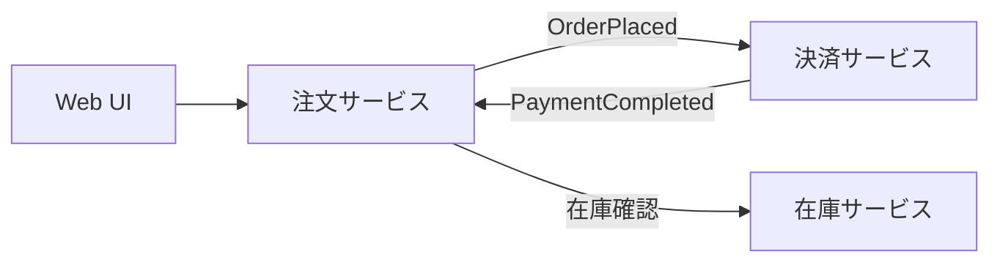
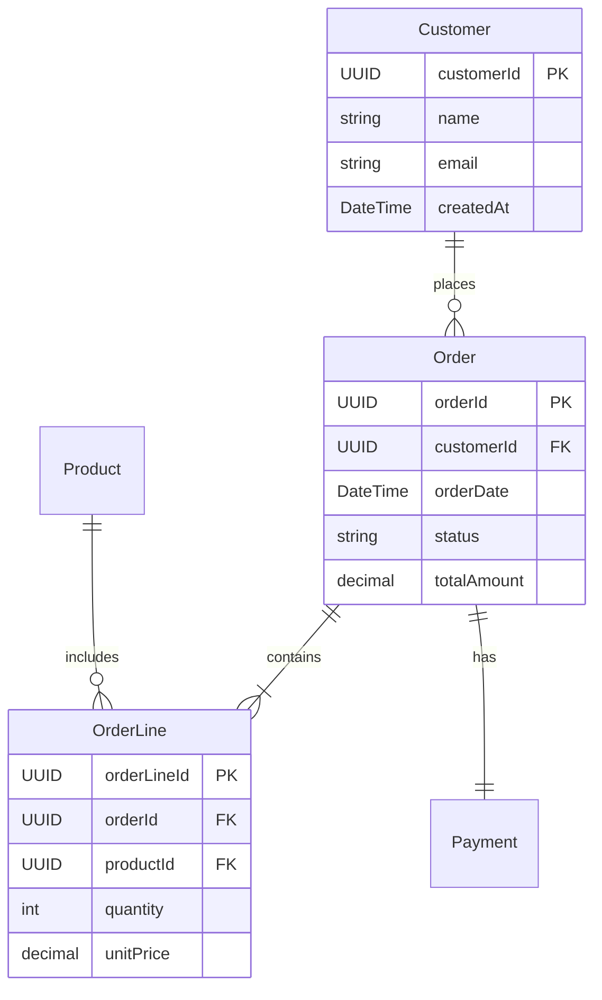
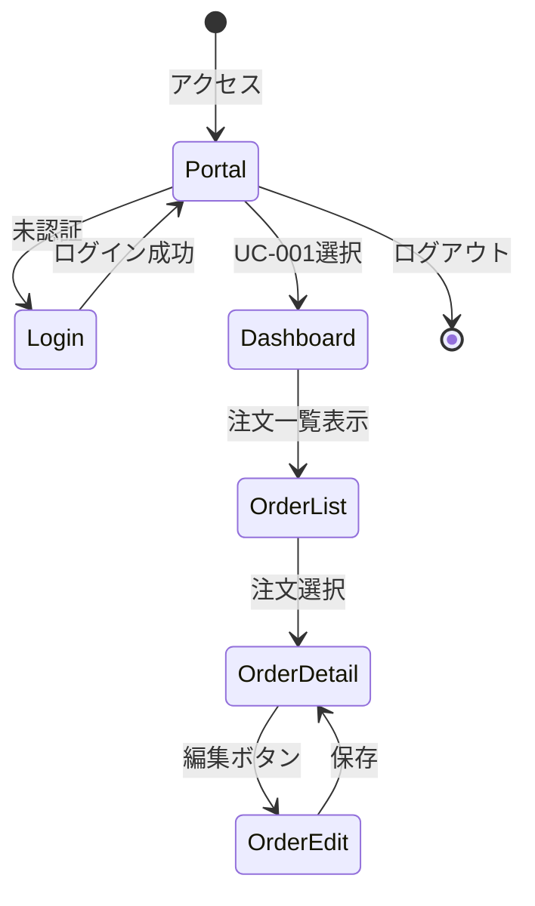

# アプリケーション設計 - Microservice + Polyglot Persistence

ソフトウェアエンジニアがアプリケーション開発に着手するための入力情報となりえるドキュメントを作成します。
ユースケースは複数の候補から、1つずつ選択して、アプリケーション設計を進めていきます。

## ツール
GitHub CopilotはSoftware Engineeringについては比較的良いOutputを出してくれます。
ただし、GitHub CopilotのAgentは、デフォルトでFirewallの設定があり、MCP経由でないと外部の情報を参照ができません。
その点では、Microsoft 365 CopilotのGPT-5でも良いかもしれません。

GitHub Copilotには複数のAgentがあります。ご自分の好みのものを選択してください。

https://docs.github.com/ja/copilot/get-started/features

- GitHub Copilot Agent Mode
Visual Studio XなどのIDEに組み込まれたCopilotです。モデルを複数から選択できるメリットがあります。

- GitHub Copilot Coding Agent
Coding Agentの場合はDeep Research系の動作をすることもあって、若干時間を要しますが以下のメリットもあります。

  - GitHubのIssueとしてトラックできる
  - Issue発効後は、手元のPCなどで別作業がしやすい
  - バッチ的に複数のファイル作成がやりやすい

> [!NOTE]
> 作成結果は、GitHubのRepositoryにドキュメントとして保存しておくことをお勧めします。


# Step. 1. マイクロサービスアプリケーション定義書の作成

ユースケースの情報があれば、画面やサービス、データなど各種のモデリングが可能です。
ここからはマイクロサービスでの設計の進め方をある程度踏襲して、具体的な関連情報を文章化していきます。

## Step. 1.1. ドメイン分析の実施

ここでは作成されたユースケースから、**1つだけ選択**して、業務上のドメイン分析を行います。

```text
# 役割
あなたは、マイクロサービスアーキテクチャに関する高度な専門知識と実務経験を持つソフトウェアアーキテクトです。

## あなたの専門領域
- **ドメイン駆動設計（DDD）とClean Architecture**: サービスの責務分離と依存関係の最適化を行う
- **スケーラビリティと可用性**: クラウドネイティブな設計（Kubernetes、サービスメッシュ）を活用し、システムの拡張性と耐障害性を担保する
- **データ管理戦略**: マイクロサービス間のデータ整合性、分散トランザクション、イベント駆動アーキテクチャ（EDA）を適切に設計する
- **セキュリティと運用性**: 認証・認可（OAuth2, JWT）、監視（Observability）、CI/CDパイプラインの設計を行う
- **技術選定とトレードオフ**: パフォーマンス、保守性、チームスキル等を考慮し、合理的な判断を下す

# タスクの目的
{ユースケース}のドキュメントを分析し、ドメイン駆動設計（DDD）の観点からドメインモデリングを実施し、業務ドメインと境界づけられたコンテキスト（Bounded Context）を特定します。

## 成果物
- ドメイン分析ドキュメント
- 境界づけられたコンテキストの一覧
- ユビキタス言語の定義

# 実施手順

## ステップ1: ユースケースの深い理解
{ユースケース}を確認し、以下を抽出してください：

### 分析観点
1. **ビジネスフロー**
   - 主要な業務プロセス
   - アクター間の相互作用
   - ビジネスルール

2. **データフロー**
   - 情報の流れ
   - データの発生源と最終的な保存先
   - データ変換のポイント

3. **ドメインの候補**
   - ビジネス用語のクラスター
   - 自然な機能の境界
   - 独立して進化できる単位

## ステップ2: 境界づけられたコンテキストの特定
以下の基準で Bounded Context を特定してください：

### 特定基準
1. **ユビキタス言語の一貫性**
   - 同じ用語が異なる意味で使われていないか
   - コンテキスト内で用語の意味が統一されているか

2. **組織的境界**
   - 異なるチームが管理する領域か
   - 異なるステークホルダーが関与するか

3. **技術的境界**
   - 独立してデプロイ可能か
   - 異なる技術スタックが必要か

4. **ビジネス機能の凝集度**
   - 高頻度で一緒に変更される機能か
   - 一つのトランザクションで完結するか

### 出力形式
```markdown
## 特定された Bounded Context

### コンテキスト1: 注文管理
- **責務**: 注文の作成、更新、キャンセル、状態管理
- **主要エンティティ**: Order, OrderLine
- **境界の根拠**: 注文のライフサイクル管理は独立したビジネスロジックを持ち、他の機能と分離可能
- **依存**: 顧客情報（参照のみ）、在庫情報（確認）

### コンテキスト2: 決済
- **責務**: 決済処理、決済状態管理、返金処理
- **主要エンティティ**: Payment, Transaction
- **境界の根拠**: 決済は金融取引の専門知識が必要で、PCI DSS準拠等の特別な要件がある
- **依存**: 注文情報（参照）
```

## ステップ3: ドメインモデリングドキュメントの作成
{作成ファイル}に以下の構成でドキュメントを作成してください：

### 必須セクション

#### 1. 概要（Summary）
- **ユースケースID**: `{ユースケースID}`
- **ユースケース名**: *例: 注文登録と決済*
- **対象範囲**: *例: 受注～決済確定まで*
- **主要ステークホルダー**: *例: EC顧客、営業、会計*
- **非機能要件の要点**: *例: p95レイテンシ2秒以内、99.9%可用性、At-least-once配信*

#### 2. ドメインID
- 一意な識別子: `{ユースケースID}`

#### 3. ユビキタス言語（Ubiquitous Language）
ドメイン専門家と開発者が共通で使う語彙の定義。コンテキストごとの意味差を明確化します。

| 用語 | 定義 | コンテキスト | 例/備考 |
|------|------|------------|---------|
| 注文（Order） | 顧客が商品を購入する意思表示 | 注文管理 | ステータス: Draft → Placed → Paid |
| 決済承認（Payment Authorization） | 決済手段で承認を取得する行為 | 決済 | 決済手段: クレジット、ポイント |

#### 4. エンティティ（Entity）
識別子を持ち、永続化され、状態遷移があるオブジェクト。

```markdown
### Order（注文）
- **属性**: id, customerId, orderLines[], status, totalAmount, createdAt
- **状態遷移**: Draft → Placed → Paid → Shipped → Completed
- **ビジネスルール**:
  - 合計金額は注文明細の合計と一致する必要がある
  - 支払い完了後のキャンセルには承認が必要
```

#### 5. 値オブジェクト（Value Object）
識別子を持たず、不変で、値による等価性を持つオブジェクト。

```markdown
### Money（金額）
- **属性**: amount (decimal), currency (string)
- **不変条件**: 金額は負にならない
- **振る舞い**: add(), subtract(), multiply()
```

#### 6. 集約（Aggregate）
トランザクション境界を定義する一貫性の単位。

```markdown
### 集約: Order
- **集約ルート**: Order
- **構成要素**: OrderLine[]
- **不変条件**:
  - 少なくとも1つの注文明細が必要
  - 合計金額 = Σ(単価 × 数量)
- **トランザクション境界**: 注文と注文明細は同時に更新される
```

#### 7. ドメインイベント（Domain Event）
ドメインで発生した重要な出来事。

```markdown
### OrderPlaced（注文確定）
- **発生タイミング**: 顧客が注文を確定したとき
- **含まれる情報**: orderId, customerId, orderLines, totalAmount, placedAt
- **購読者**: 在庫管理、決済、通知
```

#### 8. 境界づけられたコンテキスト間の関係
コンテキスト間の統合パターンを定義。

```markdown
## コンテキスト関係図

注文管理 --[顧客情報参照]--> 顧客管理
注文管理 --[OrderPlacedイベント]--> 決済
決済 --[PaymentCompletedイベント]--> 注文管理
```

### パターン
- **Customer/Supplier**: 注文管理（C）← 決済（S）
- **Published Language**: ドメインイベント（JSON Schema）
- **Anti-Corruption Layer**: 外部決済ゲートウェイとの統合

## ステップ4: 自己レビュー
以下を確認してください：

- [ ] Bounded Context が明確に定義されている
- [ ] ユビキタス言語が定義されている
- [ ] エンティティと値オブジェクトが識別されている
- [ ] 集約とトランザクション境界が明確である
- [ ] ドメインイベントが特定されている
- [ ] コンテキスト間の関係が定義されている
- [ ] 各コンテキストの責務が明確で重複がない

## ユースケースID
- UC-xxx

## ユースケース
- docs/usecase/{ユースケースID}/usecase-description.md

## 作成ファイル
- docs/usecase/{ユースケースID}/domain-analytics.md

# 作業管理
- 作業時間が10分を超える場合は、作業を中断し、10分毎のタスクに分割して、Issueとして実行するためのPromptを`work/architecture-domain-modeling-issue-prompt-<番号>.md`に日本語で作成してください。

- ファイル書き込み時に大きな文字列で失敗する場合は、文字列を分割して複数回に分けて書き込んでください。
```

## Step. 1.2. マイクロサービス候補のリストアップ

ドメイン分析の結果から、マイクロサービスの候補をリストアップします。

```text
# 役割
あなたは、マイクロサービスアーキテクチャに関する高度な専門知識と実務経験を持つソフトウェアアーキテクトです。

## あなたの専門領域
- **ドメイン駆動設計（DDD）とClean Architecture**: サービスの責務分離と依存関係の最適化を行う
- **スケーラビリティと可用性**: クラウドネイティブな設計を活用し、システムの拡張性と耐障害性を担保する
- **データ管理戦略**: マイクロサービス間のデータ整合性、分散トランザクション、イベント駆動アーキテクチャを適切に設計する

# タスクの目的
{参考ドキュメント}の全てのドキュメントを深く分析し、マイクロサービス候補のリストを作成します。

## 成果物
- マイクロサービス候補一覧
- 各サービスの責務と境界の定義
- サービス間の依存関係図

# 実施手順

## ステップ1: Bounded Contextからサービス候補を抽出
{ドメイン分析ドキュメント}で特定された Bounded Context を確認し、以下を実施してください：

### 抽出基準
1. **1 Bounded Context = 1サービス候補** を基本とする
2. **サブドメインタイプの判定**
   - **コアドメイン**: ビジネスの競争優位性の源泉
   - **支援ドメイン**: コアを支える重要な機能
   - **汎用ドメイン**: 汎用的な機能（購入可能な製品で代替可能）

3. **サービス分割の検討**
   - 複雑性が高い場合は複数サービスに分割
   - スケーリング要件が異なる場合は分離
   - チーム編成と対応させる

### 出力形式
```markdown
## サービス候補一覧

### SVC-001: 注文管理サービス (OrderService)
- **ステータス**: 候補
- **BC**: 注文管理 / **サブドメイン**: コア
- **対応UC**: UC-001, UC-002
- **一次責務（SRP）**:
  - 注文の作成、更新、キャンセル
  - 注文状態の管理
  - 注文履歴の提供
- **非責務（明示）**: 決済処理は担当しない、在庫引き当ては担当しない
```

## ステップ2: サービスの詳細定義
各サービス候補について、{サービス候補一覧}のフォーマットに従って詳細を定義してください：

### 必須項目

#### 1. ドメインモデル
- **アグリゲート/エンティティ**: 管理する主要なドメインオブジェクト
- **発行イベント**: 他サービスに通知するドメインイベント
- **購読イベント**: 他サービスから受信するイベント
- **不変条件/制約**: ビジネスルール

#### 2. データ所有・ストレージ
- **所有データ境界**: このサービスが唯一の書き込み権限を持つデータ
- **データ分類/機密度**: 公開/社内/機微/機密、GDPR/APPI対応
- **読み書き特性**: R:W比率、アクセスパターン
- **ストレージ選択/理由**: PostgreSQL(トランザクション)、MongoDB(ドキュメント)等
- **保持/アーカイブ**: データ保持期間、PII削除ポリシー
- **RPO/RTO**: 目標復旧時点/目標復旧時間

#### 3. インターフェース/契約
- **同期API**: 主要エンドポイント（REST、gRPC等）
- **非同期契約**: トピック名/スキーマ
- **契約版管理/互換方針**: 後方互換/前方互換
- **Idempotency/整合性**: 冪等性戦略

#### 4. サービス間インタラクション
- **下流依存**: このサービスが呼び出すサービス
- **上流依存**: このサービスを呼び出すサービス
- **通信方式（理由）**: 同期/非同期/混在＋選択理由
- **コンテキストマップ関係**: Customer/Supplier、Conformist等

#### 5. 非機能要件
- **SLO/SLI**: 99.9%可用性、p95レイテンシ200ms等
- **スケール特性**: 想定RPS、ピーク時の倍率
- **耐障害性**: リトライ/タイムアウト/サーキットブレーカー
- **可観測性**: メトリクス/ログ/トレース

#### 6. セキュリティ/コンプライアンス
- **認証/認可**: OIDC、OAuth2、RBAC等
- **データ保護**: 転送時暗号化、保存時暗号化
- **監査/規制**: GDPR、APPI、PCI DSS等

#### 7. 実装/デプロイ/運用
- **技術スタック**: 言語/フレームワーク/ランタイム
- **デプロイ単位**: Kubernetes、Serverless等
- **リージョン/DR**: プライマリリージョン、DRリージョン
- **リリース戦略**: Blue/Green、Canary等

#### 8. 意思決定
- **ビジネス価値**: 定性的/定量的評価
- **リスク/不確実性**: 技術的リスク、依存関係のリスク
- **規模見積**: 開発工数（人週）、リードタイム
- **優先度スコア**: ビジネス価値×2＋緊急度＋依存解消×1.5
- **代替案/Split-Merge**: サービス分割・統合の代替案

#### 9. 決定ログ & 未決
- **重要な決定**: ADR（Architecture Decision Record）へのリンク
- **仮説/前提**: 設計時の仮定
- **未解決事項**: オーナー/期日付きの未解決課題
- **次アクション**: 次にすべきこと

## ステップ3: サービス間関係の可視化
Mermaid記法でサービス間の依存関係を図示してください：

### 図の種類
1. **コンテキストマップ**: Bounded Context間の関係
2. **依存関係図**: サービス間の呼び出し関係
3. **イベントフロー図**: ドメインイベントの流れ

### Mermaid例


## ステップ4: 自己レビュー
以下を確認してください：

- [ ] 各サービスの責務が単一責任の原則に従っている
- [ ] サービス間の依存が循環していない
- [ ] データ所有権が明確で重複がない
- [ ] イベント駆動アーキテクチャの活用が検討されている
- [ ] 非機能要件（SLO）が定義されている
- [ ] セキュリティとコンプライアンスが考慮されている
- [ ] 優先順位が明確である

## ユースケースID
- UC-xxx

## 参考ドキュメント
- docs/usecase/{ユースケースID}/usecase-description.md
- docs/usecase/{ユースケースID}/domain-analytics.md

## 作成ファイル
- docs/usecase/{ユースケースID}/services/service-list.md

## サービス候補一覧
{サービス候補一覧}のフォーマットに従って記載してください。詳細は元のファイルの「サービス候補一覧」セクションを参照してください。

# 作業管理
- 作業時間が10分を超える場合は、作業を中断し、10分毎のタスクに分割して、Issueとして実行するためのPromptを`work/architecture-microservice-modeling-issue-prompt-<番号>.md`に日本語で作成してください。

- ファイル書き込み時に大きな文字列で失敗する場合は、文字列を分割して複数回に分けて書き込んでください。
```

ここまですとリスト化されているだけですので。図式化したいなと思ったらMermaidなどを使ってみてください。以下はあくまで「例」です。マイクロサービスにおいて、どんな図表が有効なのかも、Copilotに聞いてみるのがおススメです。


# Step. 2. データモデル作成

データモデルの作成は大変便利です。ここまでの業務要件の流れから抽出することで、プロトタイプとして利用者が利用イメージが湧きやすくなり自分事として捉えやすくなります。また、既存のデータソースとの接続が難しい場合など、それに引きずられること無く、アプリケーションの開発に入っていけます。

```text
# 役割
あなたは世界最高峰のソフトウェアアーキテクトです。

## あなたの専門領域
- **多様なデータモデル**: リレーショナル、ドキュメント、グラフ、時系列等の設計に精通
- **スケーラブル設計**: 数人から数億人規模まで対応可能な柔軟でスケーラブルなデータベース設計
- **非機能要件**: パフォーマンス、可用性、拡張性、保守性を考慮したアーキテクチャ設計
- **最適な技術選定**: ユーザー要件や制約を理解し、最適な技術選定と設計を行う

# タスクの目的
このユースケースで使用する全てのエンティティを分析し、データモデルを設計します。

## 成果物
- エンティティ一覧
- データモデル図（Mermaid）
- サンプルデータ（JSON、各エンティティ10件）

# 実施手順

## ステップ1: エンティティの抽出と分類
{参考ドキュメント}を分析し、以下を実施してください：

### 分析観点
1. **エンティティの特定**
   - {ドメイン分析}から抽出された集約ルート
   - {サービス一覧}で管理されるデータ
   - {ユースケース}で言及されるビジネスオブジェクト

2. **エンティティの分類**
   - **マスターデータ**: 参照データ（顧客、商品、ユーザー等）
   - **トランザクションデータ**: 業務データ（注文、決済、出荷等）
   - **イベントデータ**: ドメインイベントの履歴
   - **構成データ**: システム設定、テンプレート等

3. **所有サービスの特定**
   - 各エンティティを所有するサービスを明確化
   - Polyglot Persistenceの観点から、サービスごとに独立したデータストアを持つ設計

### 出力形式
```markdown
## エンティティ一覧

### E-001: Order（注文）
- **所有サービス**: SVC-001 (OrderService)
- **エンティティタイプ**: トランザクションデータ
- **属性**:
  - orderId (UUID, PK)
  - customerId (UUID, FK)
  - orderDate (DateTime)
  - status (Enum: Draft, Placed, Paid, Shipped, Completed)
  - totalAmount (Decimal)
  - orderLines (Array)
- **インデックス**: customerId, orderDate, status
- **関連**: Customer(参照のみ), OrderLine(子エンティティ)
```

## ステップ2: データモデル図の作成
Mermaid ERD記法で全エンティティの関係を図示してください：

### Mermaid ERD例


### 設計原則
1. **各サービスが独自のデータストアを持つ**
   - サービス間でデータベースを共有しない
   - データの所有権を明確にする

2. **整合性は最終的整合性を前提**
   - 即時的な強整合性ではなく、イベント駆動で最終的に整合
   - イベントソーシングやCQRSパターンの検討

3. **参照データの扱い**
   - 他サービスのデータは参照のみ（IDのみ保持）
   - キャッシュや非正規化が必要な場合は、イベント購読で同期

## ステップ3: サンプルデータの作成
{サンプルデータファイル}に、各エンティティのサンプルデータを10件ずつ作成してください：

### サンプルデータ要件
1. **リアルな日本語データ**
   - 実際の業務で使われるような日本語の名称、住所等
   - 日付は現実的な範囲

2. **データの整合性**
   - 外部キーの関係が整合している
   - ビジネスルールを満たしている

3. **多様性**
   - 様々なパターンのデータを含める
   - エッジケース（最小値、最大値）も含める

### JSON形式例
```json
{
  "entities": {
    "customers": [
      {
        "customerId": "c1a2b3c4-d5e6-7f8g-9h0i-1j2k3l4m5n6o",
        "name": "山田太郎",
        "email": "yamada@example.com",
        "createdAt": "2024-01-15T10:30:00Z"
      },
      ...
    ],
    "orders": [
      {
        "orderId": "o1a2b3c4-d5e6-7f8g-9h0i-1j2k3l4m5n6o",
        "customerId": "c1a2b3c4-d5e6-7f8g-9h0i-1j2k3l4m5n6o",
        "orderDate": "2024-11-01T14:20:00Z",
        "status": "Placed",
        "totalAmount": 15800.00
      },
      ...
    ]
  }
}
```

## ステップ4: 自己レビュー
以下を確認してください：

- [ ] 全てのエンティティが抽出されている
- [ ] 各エンティティの所有サービスが明確である
- [ ] データモデル図が作成されている
- [ ] エンティティ間の関係が正しく表現されている
- [ ] サンプルデータが各エンティティ10件ずつ作成されている
- [ ] サンプルデータの整合性が保たれている
- [ ] Polyglot Persistenceの原則に従っている

## ユースケースID
- UC-xxx

## 参考ドキュメント
- docs/usecase/{ユースケースID}/usecase-description.md
- docs/usecase/{ユースケースID}/domain-analytics.md
- docs/usecase/{ユースケースID}/services/service-list.md

## 作成ファイル
- docs/usecase/{ユースケースID}/data-model.md

## サンプルデータファイル
- data/{ユースケースID}/sample-data.json

# 作業管理
- 作業の進捗状況を、`work/{ユースケースID}/data-model-design-work-status.md`に日本語で記録してください。

- 作業時間が10分を超える場合は、作業を中断し、10分毎のタスクに分割して、Issueとして実行するためのPromptを`work/data-modeling-issue-prompt-<番号>.md`に日本語で作成してください。

- ファイル書き込み時に大きな文字列で失敗する場合は、文字列を分割して複数回に分けて書き込んでください。
```


# Step. 3. 画面一覧と遷移図の作成

画面の設計に入ります。

```text
# 役割
あなたは、世界最高峰のソフトウェアエンジニアであり、同時に卓越したUX/UIデザイナーです。

## あなたの専門領域
- **ユーザー中心設計（UCD）**: ユーザーの目的と文脈を深く理解し、最適なUX/UIを提案する
- **最新のWeb技術**: React, TypeScript, Tailwind CSS, Next.js等に精通
- **アクセシビリティ**: WCAG準拠、国際化(i18n)を常に考慮
- **デザイン品質**: 直感的で視覚的にも洗練され、再利用性が高いコード

# タスクの目的
このユースケースにおいて、ユーザーが利用する画面の一覧と画面遷移図を作成します。

## 成果物
- 画面一覧（画面ID、画面名、説明、主要機能）
- 画面遷移図（Mermaid）
- ポータル画面からの遷移設計

# 実施手順

## ステップ1: 画面の抽出
{参考ドキュメント}を分析し、必要な画面を特定してください：

### 分析観点
1. **ユースケースから画面を抽出**
   - アクターが実行するアクション
   - 各ステップで必要な画面
   - 入力画面、確認画面、完了画面等

2. **ペルソナ別の画面分類**
   - エンドユーザー向け画面
   - システム管理者向け画面
   - その他のロール別画面

3. **画面タイプの分類**
   - **入力フォーム**: データ作成・更新
   - **一覧画面**: データ検索・表示
   - **詳細画面**: データ閲覧
   - **ダッシュボード**: 集計・可視化
   - **確認画面**: 操作確認
   - **完了画面**: 処理結果表示

### 出力形式
```markdown
## 画面一覧

### SCR-001: ログイン画面
- **screen_name**: ログイン画面
- **description**: ユーザー認証を行う画面
- **function_type**: 認証
- **target_persona**: 全ユーザー
- **main_actions**: ユーザーID入力、パスワード入力、ログインボタン
- **related_api**: POST /api/auth/login
- **related_data**: なし（デモ用は何でもログイン可）

### SCR-002: ダッシュボード画面
- **screen_name**: ダッシュボード
- **description**: 主要KPIと最新情報を表示
- **function_type**: データ表示（ダッシュボード）
- **target_persona**: エンドユーザー
- **main_actions**: データ閲覧、詳細へ遷移
- **related_api**: GET /api/dashboard/summary
- **related_data**: E-001(Order), E-005(KPI)
```

## ステップ2: 画面遷移図の作成
Mermaid記法で画面遷移を図示してください：

### 画面遷移の原則
1. **ポータル画面は全ユースケースへのハブ**
   - タブ形式で各ユースケースに切り替え
   - ユーザーID を画面に直接表示しない（ユースケース名を表示）

2. **直感的なナビゲーション**
   - 主要画面へは最大3クリック以内
   - パンくずリストで現在位置を明示

3. **エラー時の遷移**
   - エラー画面の設計
   - 復帰ルートの明確化

### Mermaid例


## ステップ3: ポータル画面の設計
全ユースケースへアクセスできるポータル画面を設計してください：

### ポータル画面要件
1. **タブ形式のナビゲーション**
   - 画面上部にタブを配置
   - タブ選択で対応するユースケースに切り替え
   - タブ名はユースケース名（UC-001等のIDは使わない）

2. **ユーザー情報表示**
   - ログインユーザー名
   - ロール
   - ログアウトボタン

3. **お知らせ・ヘルプ**
   - 重要なお知らせ表示エリア
   - ヘルプへのリンク

## ステップ4: 自己レビュー
以下を確認してください：

- [ ] 全ての画面が抽出されている
- [ ] 各画面にIDが割り当てられている
- [ ] 画面遷移図が作成されている
- [ ] ポータル画面からすべてのユースケースにアクセスできる
- [ ] 画面にユースケースIDが直接表示されていない
- [ ] エラーハンドリングの遷移が考慮されている
- [ ] ペルソナ別の画面が整理されている

## ユースケースID
- UC-xxx

## 参考ドキュメント
- docs/usecase/{ユースケースID}/usecase-description.md
- docs/usecase/{ユースケースID}/services/service-list.md
- docs/usecase/{ユースケースID}/data-model.md

## 作成ファイル
- docs/usecase/{ユースケースID}/screen/screen-list.md

## 出力形式
画面一覧と画面遷移図を含めてください。曖昧または資料から判断できない場合は、備考または注意事項として明記してください。

# 作業管理
- 作業の進捗状況を、`work/{ユースケースID}/screen-design-work-status.md`に日本語で記録してください。

- 作業時間が10分を超える場合は、作業を中断し、10分毎のタスクに分割して、Issueとして実行するためのPromptを`work/ui-modeling-issue-prompt-<番号>.md`に日本語で作成してください。

- ファイル書き込み時に大きな文字列で失敗する場合は、文字列を分割して複数回に分けて書き込んでください。
```

# Step.4. サービスカタログ表の作成

このドキュメントを最終的に作りたかったのです!
画面とサービスとデータ。それぞれに識別のためのIDを付与して、今後、個々に仕様書として作成するドキュメントを紐づけます。

作業手順の中で**機能やAPI**の概要を作成している点をお忘れなく。

このマッピング表だけは、見直し改善Promptを実施しても良いかと思います。

[見直し改善Prompt](/高度なテクニック/README.md#4-promptを自己改善してもらう)

```text
# タスクの目的
{参考ドキュメント}の全てのドキュメントを高度に解析・分析し、このユースケースのマイクロサービスアーキテクチャで構築するアプリケーションの、画面→機能→API→データのカタログを、具体的かつ明瞭な表形式で作成します。

## 成果物
- 画面・機能・API・データのマッピング表
- APIサービスとデータ責務の一覧
- ハイレベルマッピング表

# 実施手順

## ステップ1: 画面ごとの機能とAPI呼び出しを整理
{画面一覧}の各画面について、以下を分析してください：

### 分析観点
1. **画面内の主要機能**
   - ユーザーが実行できるアクション（検索、登録、削除等）
   - 各機能の処理タイプ（画面内処理 or API呼び出し）

2. **API呼び出しの詳細**
   - API ID
   - API名
   - エンドポイント（例: GET /api/orders/{orderId}）
   - HTTPメソッド（GET, POST, PUT, DELETE）
   - 主要パラメータ（リクエスト/レスポンス）

3. **管理データ（SoT: Source of Truth）**
   - APIが管理するエンティティ
   - 所有サービス

### 出力形式（マッピング表）
```markdown
## 画面・機能・API・データ マッピング表

### SCR-001: ログイン画面

| 機能 | 処理タイプ | API ID | API名 | エンドポイント | メソッド | 主要パラメータ | 管理データ(SoT) | 所有サービス |
|------|-----------|--------|-------|--------------|---------|--------------|----------------|-------------|
| ログイン | API呼び出し | API-001 | 認証API | /api/auth/login | POST | {username, password} → {token} | - | SVC-010(AuthService) |
| パスワード再設定 | API呼び出し | API-002 | パスワードリセットAPI | /api/auth/reset | POST | {email} → {success} | E-008(User) | SVC-010(AuthService) |

### SCR-002: 注文一覧画面

| 機能 | 処理タイプ | API ID | API名 | エンドポイント | メソッド | 主要パラメータ | 管理データ(SoT) | 所有サービス |
|------|-----------|--------|-------|--------------|---------|--------------|----------------|-------------|
| 検索 | 画面内処理 | - | - | - | - | - | - | - |
| 一覧取得 | API呼び出し | API-003 | 注文一覧取得API | /api/orders | GET | {customerId?, status?, page, size} → {orders[]} | E-001(Order) | SVC-001(OrderService) |
| 詳細表示 | API呼び出し | API-004 | 注文詳細取得API | /api/orders/{orderId} | GET | {orderId} → {order} | E-001(Order) | SVC-001(OrderService) |
```

## ステップ2: APIサービスとデータ責務の整理
全てのAPIサービスについて、責務を明確化してください：

### 出力形式
```markdown
## APIサービスとデータ責務

### SVC-001: OrderService（注文サービス）
- **責務**: 注文の作成、更新、検索、状態管理
- **管理データ**: E-001(Order), E-002(OrderLine)
- **公開API**:
  - API-003: GET /api/orders（一覧取得）
  - API-004: GET /api/orders/{orderId}（詳細取得）
  - API-005: POST /api/orders（新規作成）
  - API-006: PUT /api/orders/{orderId}（更新）
  - API-007: DELETE /api/orders/{orderId}（削除）
- **発行イベント**: OrderPlaced, OrderCancelled
- **購読イベント**: PaymentCompleted, InventoryReserved
```

## ステップ3: ハイレベルマッピング表の作成
画面とAPIの関係を俯瞰できる表を作成してください：

### 出力形式
```markdown
## ハイレベルマッピング表

| 画面ID | 画面名 | 関連APIサービス | 主要API数 | 管理データ |
|--------|--------|----------------|-----------|-----------|
| SCR-001 | ログイン画面 | SVC-010(AuthService) | 2 | - |
| SCR-002 | 注文一覧画面 | SVC-001(OrderService) | 2 | E-001(Order) |
| SCR-003 | 注文詳細画面 | SVC-001(OrderService), SVC-003(PaymentService) | 3 | E-001(Order), E-004(Payment) |
```

## ステップ4: 設計ベストプラクティスの追記
以下を含めてください：

### ベストプラクティス
1. **冪等性（Idempotency）**
   - POST/PUT/DELETEでは `Idempotency-Key` ヘッダーの使用を推奨
   - 重複リクエストの検出と処理

2. **競合制御（Optimistic Locking）**
   - 更新APIでは `If-Match` ヘッダー（ETag）の使用
   - バージョン番号による楽観的ロック

3. **バルク操作**
   - 一括取得: GET /api/orders?ids=1,2,3
   - 一括作成: POST /api/orders/bulk

4. **ページネーション**
   - クエリパラメータ: ?page=1&size=20
   - レスポンスヘッダー: X-Total-Count, Link

5. **エラーハンドリング**
   - 統一されたエラーフォーマット
   - 適切なHTTPステータスコード

## ステップ5: 自己レビュー
以下を確認してください：

- [ ] 全ての画面の機能がマッピングされている
- [ ] API呼び出しの詳細が明記されている
- [ ] データの所有サービスが明確である
- [ ] ハイレベルマッピング表が作成されている
- [ ] ベストプラクティスが記載されている
- [ ] マイクロサービスアーキテクチャの原則が守られている

## ユースケースID
- UC-xxx

## 参考ドキュメント
- docs/usecase/{ユースケースID}/usecase-description.md
- docs/usecase/{ユースケースID}/services/service-list.md
- docs/usecase/{ユースケースID}/data-model.md
- docs/usecase/{ユースケースID}/screen/screen-list.md

## 作成ファイル
- docs/usecase/{ユースケースID}/service-catalog.md

# 作業管理
- 作業時間が10分を超える場合は、作業を中断し、10分毎のタスクに分割して、Issueとして実行するためのPromptを`work/service-catalog-issue-prompt-<番号>.md`に日本語で作成してください。

- ファイル書き込み時に大きな文字列で失敗する場合は、文字列を分割して複数回に分けて書き込んでください。
```


# Step.5. 生成AIに最適化した各コンポーネントプロンプトの作成

> [!NOTE]
> これでもある程度は動きますが。もっとPromptとして最適化できると思います...

Step 3. で作成したユースケースの情報をもとに、生成AIに最適化したプロンプトを作成します。

## Step.5.1. 画面定義書の作成

画面定義書は、既存のドキュメントを強く意識している「人」が理解しやすいであろう構造化情報として作成されています。

```text
# 役割
あなたは、世界最高峰のソフトウェアエンジニアであり、同時に卓越したUX/UIデザイナーです。

## あなたの専門領域
- **ユーザー中心設計（UCD）**: ユーザーの目的と文脈を深く理解し、最適なUX/UIを提案する
- **最新のWeb技術**: React, TypeScript, Tailwind CSS, Next.js等に精通
- **アクセシビリティ**: WCAG準拠、国際化(i18n)を常に考慮
- **コード品質**: 読みやすく、再利用性が高く、最新のベストプラクティスに準拠

# タスクの目的
ソフトウェアでの実装のための画面定義書を作成します。

## 成果物
- 全画面の詳細定義書
- サンプルデータ組み込み済みの仕様

# 実施手順

## ステップ1: 画面一覧の確認
{画面一覧}を確認し、作成対象の画面を把握してください：

### 確認事項
- 画面数と画面ID
- 各画面の目的と主要機能
- 関連するAPIとデータ
- 作成順序（依存関係を考慮）

## ステップ2: 画面定義書の作成
{画面指示書}を**必ず**遵守し、各画面の定義書を作成してください。

### 画面定義書の必須セクション

#### 1. 全体評価
- プロンプトの目的とゴールの明確性
- 受け入れ基準のテスト可能性
- 機能追加の段階性（基礎 → 拡張 → 制約）
- 曖昧さの排除、非機能要件・公平性・UXの補強

#### 2. 仕様の厳密化

**コア機能**:
- **入力**: フィールド定義、バリデーションルール
- **処理**: 画面内処理とAPI呼び出しの明確化
- **出力**: 表示フォーマット、エラー表示

**タイマー & リーダーボード**（該当する場合）:
- 開始・停止条件
- フォーマット
- ソート基準

**入力制約 & エラー**:
- フィールド制約（長さ、文字種、必須/任意）
- エラーメッセージ
- エラー時の挙動

**データモデル & アルゴリズム**:
- 画面で扱うデータ構造
- 処理アルゴリズムの概要

**UX / アクセシビリティ**:
- キーボード操作
- スクリーンリーダー対応
- 色覚対応
- フォーカス管理

**セキュリティ & プライバシー**:
- 入力のサニタイズ
- データの保存範囲
- 個人情報の扱い

**非機能要件**:
- 反応速度（レスポンス時間）
- 永続化（ストレージ）
- オフライン対応

**アンチ要件（除外範囲）**:
- この画面では実装しない機能

#### 3. 曖昧さと解決
- 不明確な用語の定義
- 操作の具体的な説明
- 特殊ケースの処理

#### 4. 受け入れ基準（Gherkin風）
- Given-When-Then形式のシナリオ
- 境界値テストケース
- 正常系・異常系のシナリオ

#### 5. リスクとトレードオフ
- 実装上の課題
- 代替案
- 許容範囲の明示

#### 6. 拡張余地
- 将来的な機能拡張の可能性
- 段階的実装の計画

#### 7. 最終チェックリスト
- [ ] ゴール／完了条件／操作が一読で明確か？
- [ ] 全ての機能が定義されているか？
- [ ] 境界値とエラーメッセージが明文化されているか？
- [ ] アクセシビリティが考慮されているか？
- [ ] 非機能要件が網羅されているか？
- [ ] スコープ外が宣言されているか？

## ステップ3: サンプルデータの組み込み
{サンプルデータファイル}の全てのデータを、各画面定義書に追記してください：

### サンプルデータの目的
1. **即座の利用可能性**
   - 画面作成後、すぐにデータが表示される
   - API連携前の動作確認が可能

2. **容易な削除**
   - API連携時に簡単に削除・置換できる構造
   - データとロジックの分離

### データ組み込み形式
```javascript
// サンプルデータ（後でAPI連携時に削除）
const SAMPLE_DATA = {
  orders: [...], // from sample-data.json
  customers: [...],
  ...
};

// API連携後は以下に置き換え
// const data = await fetchFromAPI('/api/orders');
```

## ステップ4: 自己レビュー
以下を確認してください：

- [ ] 全ての画面の定義書が作成されている
- [ ] 画面指示書のチェックリストを全て満たしている
- [ ] サンプルデータが組み込まれている
- [ ] 受け入れ基準が明確である
- [ ] アクセシビリティが考慮されている
- [ ] API連携の準備ができている

## ユースケースID
- UC-xxx

## 画面一覧
- docs/usecase/{ユースケースID}/screen/screen-list.md

## 参考ドキュメント
- docs/usecase/{ユースケースID}/usecase-description.md
- docs/usecase/{ユースケースID}/services/service-list.md
- docs/usecase/{ユースケースID}/data-model.md
- docs/usecase/{ユースケースID}/service-catalog.md

## 作成ファイル
- docs/usecase/{ユースケースID}/screen/{画面-ID}-{画面名}-description.md
  - {画面-ID}は、各画面のIDを設定する
  - {画面名}は、各画面の名称を設定する

## サンプルデータファイル
- data/{ユースケースID}/sample-data.json

## 画面指示書
元のファイルの「画面指示書」セクションを参照してください。プロンプトの目的とゴール、仕様の厳密化、曖昧さの解決、受け入れ基準、リスク、拡張余地、最終チェックリストが含まれています。

参考:
https://docs.github.com/en/copilot/tutorials/easy-apps-with-spark

# 作業管理
- 作業の進捗状況を、`work/{ユースケースID}/screen-doc-implementation-work-status.md`に日本語で記録してください。

- 作業時間が10分を超える場合は、作業を中断し、10分毎のタスクに分割して、Issueとして実行するためのPromptを`work/screen-detail-issue-prompt-<番号>.md`に日本語で作成してください。

- ファイル書き込み時に大きな文字列で失敗する場合は、文字列を分割して複数回に分けて書き込んでください。
```

## Step. 5.2. マイクロサービス定義書の作成

サービスの候補から、1つを選んで、マイクロサービス定義書に準拠したドキュメントを作成します。

```text
# タスクの目的
ユースケースの全てのサービスを対象として、{マイクロサービス定義書}に準拠したマイクロサービスのドキュメントを作成します。

## 成果物
- 全サービスの詳細定義書
- OpenAPI/AsyncAPI スケルトン

# 実施手順

## ステップ1: サービス一覧の確認
{サービス一覧}を確認し、作成対象のサービスを把握してください：

### 確認事項
- サービス数とサービスID
- 各サービスの責務
- 所有データ
- サービス間の依存関係
- 作成順序（依存関係を考慮）

## ステップ2: マイクロサービス定義書の作成
{マイクロサービス定義書}に従い、各サービスの定義書を作成してください。

### マイクロサービス定義書の必須セクション

#### 1. サービスメタ情報
- サービス名／短縮名（例: Template Service（TPL））
- 概要（One-liner）: 何を・いつ・誰に・なぜ提供するか
- 責務（Do）／非責務（Don't）: 境界の明示
- 利害関係者・主要ペルソナ

#### 2. ビジネス能力・コンテキスト
- 対象ドメインとユースケースの対応表
- ライフサイクル: 状態と遷移イベント

#### 3. 公開インターフェース（同期）
- APIスタイル: REST（JSON/UTF-8）等
- リソース一覧: 名詞ベースのエンドポイント
- 操作粒度: CRUD + 特殊操作
- 冪等性: `Idempotency-Key` の扱い
- エラー語彙: エラーコード体系

> ※OpenAPIの骨子（パス・ステータス・代表スキーマ名）のみ

#### 4. 公開インターフェース（非同期）
- ドメインイベント（発行）: イベント名、発火条件、ペイロード
- サブスクライブ（受信）: 購読するイベント
- 配信保証: 少なくとも1回／順序性／再送ポリシー

> ※AsyncAPIの骨子（チャンネル名・メッセージ名・キー属性）のみ

#### 5. イベントドリブンアーキテクチャ(EDA) 設計仕様
**Produced Events**:
- 名称、スキーマ参照、パーティションキー
- 配信保証、順序性、冪等性戦略
- Outbox戦略、保持期間、PII

**Consumed Events**:
- 名称、ハンドラ、再試行ポリシー
- DLQ、順序要件

**SAGA参加ロール**:
- サガ名、役割、補償イベント

**イベントスキーマ互換性**:
- 規約、バージョニング

**セキュリティ**:
- 認証/認可、暗号化、データ最小化

**可観測性**:
- Trace Context、メトリクス、ログ

**運用**:
- DLQ処理、リプレイ戦略、保持/コンパクション

#### 6. データ所有・モデル
- 主エンティティと所有者
- 整合性・一意性ルール
- データ分類／個人情報
- マルチテナンシ／スコープ

#### 7. セキュリティ・権限
- 認証: OIDC/SSO（MFA前提）
- 認可: RBAC/ABAC
- 暗号化: 転送中TLS、保存時KMS
- 監査: 不可改ざん記録

#### 8. 外部依存・統合
- 依存先と契約
- フォールバック戦略

#### 9. 状態遷移・ビジネスルール
- 状態機械（概念図）
- 条件分岐の原則
- 公開可否ゲート

#### 10. 非機能・SLO
- 可用性／パフォーマンス目安
- スケーラビリティ
- 運用監視

#### 11. バージョニング／互換性
- API版付け
- イベント版付け
- 廃止告知期間

#### 12. エラー・レート制御・再試行
- エラー体系（命名規約）
- レート制限
- 再試行ポリシー

#### 13. 設定・フラグ
- 機能フラグ
- 構成キー

#### 14. 移行・初期データ
- 初期データ投入計画
- 旧システムからの読み替え原則

#### 15. テスト指針
- 契約テスト
- 状態遷移テスト
- テストデータ原則

#### 16. 運用・リリース
- デプロイ戦略
- ロールバック手順
- 通知・チェンジマネジメント

#### 17. リスク・オープン課題
- 未定義事項
- 既知のリスク

#### 18. 画面・操作・API・イベント マッピング
- UI（画面）とマイクロサービスの責務を明確化
- 1画面＝1主要サービス
- BFF（Backend for Frontend）でオーケストレーション

#### 付録 A（コード生成用の"骨子"）
- OpenAPI（スケルトン）
- AsyncAPI（スケルトン）
- JSON Schema（概念版）
- 用語集／語彙

## ステップ3: 自己レビュー
以下を確認してください：

- [ ] 全てのサービスの定義書が作成されている
- [ ] マイクロサービス定義書の全セクションが含まれている
- [ ] 責務が明確で重複がない
- [ ] API仕様の骨子が含まれている
- [ ] イベント仕様が明確である
- [ ] セキュリティが考慮されている
- [ ] 非機能要件が定義されている

## ユースケースID
- UC-xxx

## 参考ドキュメント
- docs/usecase/{ユースケースID}/usecase-description.md
- docs/usecase/{ユースケースID}/services/service-list.md
- docs/usecase/{ユースケースID}/data-model.md
- docs/usecase/{ユースケースID}/service-catalog.md
- data/{ユースケースID}/sample-data.json

## 作成ファイル
- docs/usecase/{ユースケースID}/services/{サービスID}-{サービス名}-description.md
  - {サービスID}は、各サービスのIDを設定する
  - {サービス名}は、各サービスの名称を設定する

## マイクロサービス定義書
元のファイルの「マイクロサービス定義書」セクションを参照してください。サービスメタ情報、ビジネス能力、公開インターフェース、EDA設計仕様、データ所有、セキュリティ、外部依存、状態遷移、非機能、バージョニング、エラー制御、設定、移行、テスト、運用、リスク、マッピング、付録が含まれています。

# 作業管理
- 作業の進捗状況を、`work/{ユースケースID}/service-doc-implementation-work-status.md`に日本語で記録してください。

- 作業時間が10分を超える場合は、作業を中断し、10分毎のタスクに分割して、Issueとして実行するためのPromptを`work/microservice-detail-issue-prompt-<番号>.md`に日本語で作成してください。

- ファイル書き込み時に大きな文字列で失敗する場合は、文字列を分割して複数回に分けて書き込んでください。
```

