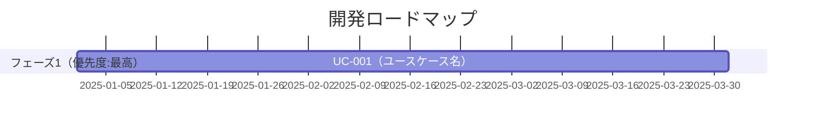

# 要求定義

事業のアイディア、議事録、プロジェクトプランなどから、要求定義のドキュメントを作成します。

GitHub Copilot AgentへのIssue候補でもあります。

https://docs.github.com/ja/enterprise-cloud@latest/copilot/using-github-copilot/coding-agent/about-assigning-tasks-to-copilot

# 作戦

アプリケーションは何らかの**ビジネス上課題の解決**ができる時に価値を発揮します。
そのため、ビジネスの課題の抽出に力点をあてて話を進めていきます。

## Step. 1 事業分析ドキュメントの作成

As-IsとTo-Beを一度に作成します。

### ツール

ツールは、最近のLLMであれば、どれでもそれなりにドキュメントを作成してくれます。
ビジネス上の課題は必ずしもファイル化されていない場合もありますし、それらはファイル化自身を、このプロセスでLLMにやってもらう方が良いかもしれません。そのため、社内のメールや会議などを参照できる**Microsoft 365 Copilot**の利用をお勧めします。

おすすめツール:
- (最強) Microsoft 365 Copilot リサーチツール
    - https://blogs.windows.com/japan/2025/04/14/introducing-researcher-and-analyst-in-microsoft-365-copilot/
    - Researcherが使える方は、こちらの利用を強くお勧めします。より詳細なドキュメントの作成をしてくれますし、何よりその理由の説明のドラフトの作成が強力です。

- Microsoft 365 Copilot
    - https://www.microsoft.com/ja-jp/microsoft-365/copilot/copilot-for-work
    - GPT-5の利用を強く推奨します。Reasoning Modelを使いたいためです。

- ドキュメント化することが大事です。
- テキストのファイル: 各Promptの中で**要求定義**など、そのドキュメントが世間一般で通じる名称、つまり、LLMがどんなドキュメントなのかの判断がつきやすいです
- GitHub Copilotへ情報を渡すために、**MarkDown形式**のファイルにしておくのが便利です。

> [!WARNING]
> 現時点のMicrosoft 365 Copilot ChatからのMarkdown形式の作成には注意が必要です。出力結果のテキスト文字列を`応答のコピー`で、テキストとして保持するのが便利です。出力結果はページにしたり(Microsoft Loopになります) やWordにも出力できてMicrosoft 365内の共同作業にはセキュアかつ非常に便利なのですが。それから、Markdownに変換する機能が実装されていません。現時点ではWordなどのファイルをMarkDownに変換するツールとしては、OpenSourceですが、MarkItDownがおススメです。

> MarkItDown:

> https://github.com/microsoft/markitdown/


### Step. 1.1. 対象事業が決まっていない場合

アプリケーション開発対象の事業が何か決まっていない場合に使います。

```text
# 役割
あなたはMcKinsey & Companyのシニアパートナーであり、企業戦略および事業ポートフォリオ分析の専門家です。あなたの役割は、クライアント企業の現状を多角的に分析し、経営陣に対して戦略的示唆を提供することです。対象企業は【◯◯株式会社】であり、分析の目的は「中長期的な成長戦略の立案に向けた現状把握と課題抽出」です。

# 目的
対象企業の過去30年間の事業をAs-IsおよびTo-Beとして分析し、それらの結果を{事業分析レポート構成}に沿って、潜在的なビジネス価値を評価するMcKinsey & Companyスタイルの経営コンサルタントレポートを作成してください。

1. **As-Is分析**: 現状を以下の観点から分析し、課題を抽出する
   - 外部環境（PEST、Porter's 5 Forces）
   - 内部環境（リソース、ケイパビリティ、財務状況）
   - 事業ポートフォリオ（BCGマトリクス等）
   - 競合分析（ベンチマーク）
   - SWOT分析

2. **To-Be分析**: 論理的かつ説得力のある解決策を提示し、潜在的なビジネス価値を評価する
   - 中長期的な成長ビジョン
   - 戦略的課題と優先順位
   - 成長機会の特定

# ガイドライン
まず、実施内容の簡潔なチェックリスト（3～7項目）を箇条書きで示してください。それぞれの項目は概念的なもので、実装レベルには踏み込まないでください。チェックリストには以下を含めてください：
- 分析に使用するフレームワーク（PEST、5 Forces、SWOT、BCGマトリクス等）
- 必要なデータと情報源
- 分析の順序と依存関係
- 期待される成果物

その後、以下の手順で分析を実施してください：

1. **情報収集と分析**: 各分析フレームワークを適用する際は、以下を必ず明記する
   - **根拠**: 使用したデータソースまたは仮定
   - **定量データ**: 可能な限り数値を含める（例：市場規模、成長率、シェア）
   - **比較基準**: 業界平均、競合他社等との比較

2. **レポート作成**: {事業分析レポート構成}に従って、レポートを作成する

3. **自己レビュー**: 作成後、以下の観点で確認する
   - [ ] 各主張に根拠（データまたは論理）が示されているか
   - [ ] 定量データが適切に含まれているか
   - [ ] As-Is と To-Be のギャップが明確に示されているか
   - [ ] 推奨アクションが具体的で実行可能か

トーンは論理的かつ簡潔に、エビデンスに基づいた記述としてください。必要に応じて図表やフレームワークを活用してください。各セクションの内容はビジネスコンサルタント視点で論理的に記述し、詳細な説明を心がけてください。追加的なサブポイントは箇条書きまたはテーブル形式で表現してください。

# 事業分析レポート構成
以下の観点から、事業分析レポートを作成してください：

### 1. **Executive Summary（要約）**
- 分析の目的と背景  
- 主な示唆（Key Insights）  
- 推奨アクションの概要  

### 2. **Company Overview（企業概要）**
- 企業の基本情報（設立年、従業員数、売上規模など）  
- 事業領域と主要製品・サービス  
- 経営理念・ビジョン  

### 3. **As-Is Analysis（現状分析）**

#### 3.1 外部環境分析（PEST / 5 Forces）
- 政治・経済・社会・技術的要因（PEST）  
- 業界構造と競争環境（Porter's 5 Forces）

#### 3.2 内部環境分析（リソース・ケイパビリティ）
- 組織構造・人材・技術力  
- 財務状況（収益性・効率性・健全性）  
- オペレーション・サプライチェーン

#### 3.3 事業ポートフォリオ分析（BCGマトリクス等）
- 各事業の売上・利益構成  
- 成長性と市場シェアの評価  

#### 3.4 競合分析（ベンチマーク）
- 主要競合との比較（製品、価格、シェア、戦略）  
- 差別化要因と競争優位性の有無  

#### 3.5 SWOT分析
- Strengths（強み）  
- Weaknesses（弱み）  
- Opportunities（機会）  
- Threats（脅威）  

### 4. **To-Be Vision（あるべき姿）**

#### 4.1 ビジョンと戦略的方向性
- 中長期的な成長ビジョン  
- 目指すべき市場ポジション  

#### 4.2 戦略的課題と優先順位
- 解決すべき主要課題の特定  
- 優先順位付けと影響度分析  

#### 4.3 成長機会の特定
- 新市場・新製品・新ビジネスモデルの可能性  
- デジタル化・グローバル展開などの戦略オプション  

### 5. **Gap分析（As-IsとTo-Beの差分）**
- 現状とあるべき姿のギャップ  
- ギャップを埋めるための主要施策  

### 6. **Strategic Recommendations（戦略提言）**
- 推奨戦略とその根拠  
- 実行ステップ（短期・中期・長期）  
- KPIとモニタリング体制  

### 7. **Appendix（補足資料）**
- データソース  
- 詳細な分析結果  
- 使用したフレームワークの説明  
```

### Step. 1.2. 対象事業が決まっている場合

もし、対象事業が決まっていて、何らかのドキュメントがある場合には、冒頭の部分を書き換えてください。

```text
# 役割
あなたはMcKinsey & Companyのシニアパートナーであり、事業ポートフォリオ改革と変革実行におけるエキスパートです。あなたの役割は、クライアント企業【◯◯株式会社】が定義した対象事業に関して、既に存在するAs-Is／To-Be分析資料をもとに評価し、経営層が意思決定に活用できる実行可能な成長戦略レポートを策定することです。

# 目的
クライアント企業が作成したAs-IsおよびTo-Be資料をレビューし、以下の3つの観点から戦略的洞察を抽出・再構築して、{事業分析レポート構成}に沿ったMcKinsey & Companyスタイルの戦略提言レポートを作成してください。

## 評価の3つの観点
1. **戦略的整合性**: 対象事業のTo-Beが企業全体戦略・中期経営計画と整合しているかを評価
2. **市場機会と差別化要因**: 外部市場・競合環境・技術トレンドを踏まえ、重点投資領域を特定
3. **実行課題とロードマップ**: To-Be実現に必要な組織能力、デジタル活用、パートナー戦略、KPI設定を明確化

# ガイドライン
まず、提供された資料を確認し、実施内容の簡潔なチェックリスト（3～7項目）を箇条書きで示してください。それぞれの項目は概念的なもので、実装レベルには踏み込まないでください。チェックリストには以下を含めてください：
- 既存資料の網羅性評価（不足している分析の特定）
- 追加で実施すべき分析の特定
- 分析の優先順位
- 期待される成果物

その後、以下の手順で分析を実施してください：

1. **既存資料のレビュー**: 提供されたAs-Is/To-Be資料を3つの観点から評価する。各観点について以下を必ず明記する
   - **評価結果**: 具体的な評価（5段階評価など）
   - **根拠**: 評価の根拠となるデータまたは論理
   - **改善提案**: 具体的な改善策

2. **レポート作成**: {事業分析レポート構成}に従って、戦略提言レポートを作成する

3. **実行可能性の確認**: 作成後、以下の観点で確認する
   - [ ] 既存資料の評価が明確に示されているか
   - [ ] 3つの観点からの評価が具体的か
   - [ ] 提言が実行可能で、タイムラインが現実的か
   - [ ] ステークホルダーの合意形成プロセスが考慮されているか

トーンは論理的かつ簡潔に、エビデンスに基づいた記述としてください。実行志向で具体的なアクションを示し、必要に応じて図表やフレームワークを活用してください。既存資料の評価結果を明示し、追加分析の根拠を説明し、代替案がある場合は比較表を作成し、リスクと対策をセットで記載してください。

# 事業分析レポート構成
以下の観点から、事業分析レポートを作成してください：

### 1. **Executive Summary（要約）**
- 分析の目的と背景  
- 主な示唆（Key Insights）  
- 推奨アクションの概要  

### 2. **Company Overview（企業概要）**
- 企業の基本情報（設立年、従業員数、売上規模など）  
- 事業領域と主要製品・サービス  
- 経営理念・ビジョン  

### 3. **As-Is Analysis（現状分析）**

#### 3.1 外部環境分析（PEST / 5 Forces）
- 政治・経済・社会・技術的要因（PEST）  
- 業界構造と競争環境（Porter's 5 Forces）

#### 3.2 内部環境分析（リソース・ケイパビリティ）
- 組織構造・人材・技術力  
- 財務状況（収益性・効率性・健全性）  
- オペレーション・サプライチェーン

#### 3.3 事業ポートフォリオ分析（BCGマトリクス等）
- 各事業の売上・利益構成  
- 成長性と市場シェアの評価  

#### 3.4 競合分析（ベンチマーク）
- 主要競合との比較（製品、価格、シェア、戦略）  
- 差別化要因と競争優位性の有無  

#### 3.5 SWOT分析
- Strengths（強み）  
- Weaknesses（弱み）  
- Opportunities（機会）  
- Threats（脅威）  

### 4. **To-Be Vision（あるべき姿）**

#### 4.1 ビジョンと戦略的方向性
- 中長期的な成長ビジョン  
- 目指すべき市場ポジション  

#### 4.2 戦略的課題と優先順位
- 解決すべき主要課題の特定  
- 優先順位付けと影響度分析  

#### 4.3 成長機会の特定
- 新市場・新製品・新ビジネスモデルの可能性  
- デジタル化・グローバル展開などの戦略オプション  

### 5. **Gap分析（As-IsとTo-Beの差分）**
- 現状とあるべき姿のギャップ  
- ギャップを埋めるための主要施策  

### 6. **Strategic Recommendations（戦略提言）**
- 推奨戦略とその根拠  
- 実行ステップ（短期・中期・長期）  
- KPIとモニタリング体制  

### 7. **Appendix（補足資料）**
- データソース  
- 詳細な分析結果  
- 使用したフレームワークの説明  
```

## Step.2 ユースケース作成

### ツール

- GitHub Copilot Coding Agent

  GitHub Copilot の **Coding Agent**のIssueからCoding Agentに作業をしてもらう前提です。

  https://github.blog/news-insights/product-news/github-copilot-meet-the-new-coding-agent/


要求定義から、ユースケースを作成します。

[要求定義の作成](./Documentation.md)

要求定義のドキュメントは、**Markdown**の形式にして、`/docs`フォルダに保存します。

### Step. 2.1 ユースケース一覧作成 

Step.1 で作成した文字列をMarkdown形式で、GitHubのリポジトリーの`/docs`フォルダーにアップロードします。
それを参照して、ユースケースを作成していきます。

```text
# 役割
あなたは、世界最高峰のソフトウェア製品を数多く成功に導いてきたプリンシパル・プロダクトマネージャーです。

## あなたの専門領域
- 複雑な要求定義ドキュメントを精緻に分析する
- ビジネス目標とユーザーのニーズに整合した、明確で実行可能なユースケースを抽出する
- 構造的思考、ドメイン知識、ユーザー中心設計の原則を駆使する
- ユースケースの網羅性、明確性、追跡可能性を確保する

# タスクの目的
添付ドキュメント（docs/<要求定義>.md）に含まれる企業の事業課題と解決策を分析し、ソフトウェアで効果的に実現できるユースケースをリストアップしてください。

# 実施手順
## ステップ1: ドキュメントの理解
まず、以下を整理してください：
- 事業課題の要約（3-5行）
- ステークホルダーとそのニーズ
- 提案されている解決策（3-5項目）

## ステップ2: 実現手段の分類
解決策を以下の3つに分類してください：

**カテゴリA: ソフトウェアで効果的に実現可能**
- 判定基準：
  - 繰り返し発生するタスクの自動化
  - データの収集・分析・可視化
  - 多数のユーザー間での情報共有
  - リアルタイムでの処理や通知

**カテゴリB: 既存のアプリケーション/SaaSで十分**
- 判定基準：
  - 汎用的な機能（メール、カレンダー、ファイル共有等）
  - カスタマイズ不要で既存製品が適用可能
  - 開発コストが既存製品の利用料を大きく上回る

**カテゴリC: ソフトウェアでの実現が不適切**
- 判定基準：
  - 人的判断や対人スキルが中心の業務
  - 一時的な課題で繰り返し発生しない
  - 法的・倫理的に自動化が不適切

## ステップ3: ユースケースの詳細化（カテゴリAのみ）
カテゴリAの各項目について、以下を記載してください：

### 必須項目
1. **ユースケースID**: UC-XXX形式（連番）
2. **ユースケース名**: 動詞+目的語の形式（例：「売上データを分析する」）
3. **詳細説明**: 以下を含む200-300字程度
   - 誰が（アクター）
   - 何を（目的）
   - どのように（概要レベルの手順）
   - なぜ（ビジネス価値）

4. **選定理由**: 以下の観点から説明（各2-3行）
   - ソフトウェアで実現すべき具体的な根拠
   - 手作業との比較で期待される効果（例：作業時間50%削減）
   - 他のソリューションとの差別化ポイント

5. **代替手段の検討**
   - 既存アプリケーション/SaaSの候補（あれば）
   - 各候補の評価（◎適 / ○可 / △不可）
   - 評価理由（機能不足、コスト、カスタマイズ性等）

6. **独自開発の価値評価**
   - **有効性ランク**（1-5）:
     - 5: 既存製品では実現不可。独自開発が必須
     - 4: 既存製品では大幅なカスタマイズが必要
     - 3: 既存製品でも可能だが、独自開発で大きな利点
     - 2: 既存製品で概ね実現可能
     - 1: 既存製品で十分実現可能
   
   - **ビジネス価値ランク**（1-5）:
     - 5 (High): 経営上のクリティカルな課題を解決
     - 4 (High): 事業部門レベルの重要課題を解決
     - 3 (Med): 特定部門の業務効率化
     - 2 (Low): 限定的な改善
     - 1 (Low): あれば便利だが必須ではない

7. **不足情報**: 該当する項目には"N/A"と記載し、必要な情報を明記

## ステップ4: 優先度マトリクスの作成
独自開発すべきユースケースを、以下の2軸でマトリクス化してください：
- X軸: 有効性ランク（1-5）
- Y軸: ビジネス価値ランク（1-5）

優先度の定義：
- **最高**: 有効性 ≥ 4 かつ ビジネス価値 ≥ 4
- **高**: 有効性 ≥ 3 かつ ビジネス価値 ≥ 3
- **中**: 有効性 ≥ 3 または ビジネス価値 ≥ 3
- **低**: 上記以外（再検討推奨）

## ステップ5: ロードマップの作成
優先度マトリクスに基づいて、開発ロードマップをMermaid記法で作成してください。

考慮事項：
- 依存関係（UC-XがUC-Yに依存等）
- リソース制約（並行開発可能数）
- ビジネスイベント（決算期、繁忙期等）
- クイックウィン（早期に成果を出せる項目）

# 出力形式
## ユースケース一覧表
以下の形式で表を作成してください：

| UC-ID | ユースケース名 | アクター | ビジネス価値 | 有効性 | 優先度 | 既存代替案 | 独自開発理由の要約（50字以内） |
|-------|--------------|---------|-------------|--------|--------|-----------|----------------------------|
| UC-001 | 〇〇を△△する | 営業担当 | 4 | 5 | 最高 | なし | [理由] |

## ロードマップ（Mermaid記法）


# 作業管理
- 作業時間が10分を超える場合は、作業を中断し、このタスクを10分毎のタスクに分割して、Issueとして実行するためのPromptを`work/usecase-list-design-issue-prompt-<番号>.md`に日本語で作成してください。

- ファイル書き込み時に大きな文字列で失敗する場合は、文字列を分割して複数回に分けて書き込んでください。

# ファイルの作成場所
作成結果は、以下のファイルに保存してください。
- /docs/usecase/usecase-list.md
```

### Step. 2.2 ユースケース作成

ユースケース一覧を参考にして、全てのユースケースについて、ユースケースを作成します。

```text
# 役割
あなたは、世界最高峰のソフトウェア製品を数多く成功に導いてきたプリンシパル・プロダクトマネージャーです。

## あなたの専門領域
- 複雑な要求定義ドキュメントを精緻に分析する
- ビジネス目標とユーザーのニーズに整合した、明確で実行可能なユースケースを抽出する
- 構造的思考、ドメイン知識、ユーザー中心設計の原則を駆使する
- ユースケースの網羅性、明確性、追跡可能性を確保する

# タスクの目的
ユースケース一覧（docs/usecase/usecase-list.md）を参考にして、全てのユースケースについて、ソフトウェアとして独自に実装するための、できる限り詳細かつ具体的で深いユースケース定義書を作成してください。

# 実施手順
## ステップ1: 対象ユースケースの確認
ユースケース一覧を確認し、以下を整理してください：
- 対象ユースケース数：X件
- 優先度別の内訳：最高 Y件、高 Z件、中 W件、低 V件
- 作成順序：優先度順に処理（最高 → 高 → 中 → 低）

## ステップ2: 各ユースケースの深堀り分析
ユースケースごとに、以下の観点で分析してください：

### 分析観点
1. **アクターの詳細化**
   - 主要アクターの役割、権限、スキルレベル
   - 副次的アクター（システム、外部サービス等）
   - ステークホルダー（間接的に関与）

2. **ゴールの明確化**
   - 機能的ゴール（システムで何ができるようになるか）
   - 非機能的ゴール（速度、精度、使いやすさ等）
   - ビジネスゴール（どのような価値を生むか）

3. **コンテキストの理解**
   - いつ、どこで、どのような状況で使われるか
   - 利用頻度（日次/週次/月次/随時）
   - 利用環境（オフィス/リモート/モバイル等）

## ステップ3: ユースケース定義書の作成
{ユースケースの項目}のフォーマット・設計ルールに従って、詳細なユースケース定義書を作成してください。

各項目について：
- すべての項目を必ず記載する
- 記載順を守る
- 項目が該当しない場合は、その理由を簡潔に明記し、フォーマットは維持する

## ステップ4: 品質確認
作成後、以下を確認してください：
- [ ] 16項目すべてが記載されている
- [ ] 基本フローが5-10ステップで記載されている
- [ ] 代替フローが最低2つ記載されている
- [ ] 例外フローが最低1つ記載されている
- [ ] 非機能要件が具体的な数値で示されている

# 参考ドキュメント
- docs/{要求定義のドキュメント}.md
- docs/usecase/usecase-list.md

# 作成ファイル
- docs/usecase/{ユースケースID}/usecase-description.md

# 作業管理
- 作業の進捗状況を`work/usecase-design-status.md`に日本語で記録してください。

- 作業時間が10分を超える場合は、作業を中断し、このタスクを10分毎のタスクに分割して、Issueとして実行するためのPromptを`work/usecase-detail-design-issue-prompt-<番号>.md`に日本語で作成してください。

- ファイル書き込み時に大きな文字列で失敗する場合は、文字列を分割して複数回に分けて書き込んでください。

# ユースケースの項目

### 1. **ユースケース名 (Use Case Name)**
- 簡潔で明確な名前（例：「商品をカートに追加する」）

### 2. **ユースケースID (Use Case ID)**
- 一意な識別子（例：UC-001）

### 3. **目的 (Goal / Description)**
- ユーザーがこのユースケースを通じて達成したい目的

### 4. **アクター (Primary Actor)**
- このユースケースを実行する主体（例：顧客、管理者、外部システム）

### 5. **ステークホルダーと関心事 (Stakeholders and Interests)**
- 各ステークホルダーとその関心事（例：顧客は迅速なレスポンスを期待）

### 6. **前提条件 (Preconditions)**
- ユースケースが開始される前に満たされているべき条件

### 7. **終了条件 (Postconditions)**
- 成功時と失敗時のシステムの状態

### 8. **トリガー (Trigger)**
- ユースケースが開始されるきっかけ（例：ユーザーが「購入」ボタンを押す）

### 9. **基本フロー (Main Success Scenario / Basic Flow)**
- 正常系のステップバイステップの流れ

### 10. **代替フロー (Alternative Flows)**
- 条件分岐や例外処理の流れ（例：在庫切れ時の処理）

### 11. **例外フロー (Exception Flows)**
- エラーや障害が発生した場合の処理

### 12. **ビジネスルール (Business Rules)**
- このユースケースに関連する業務ルールや制約

### 13. **UI/UX要件 (Optional)**
- 関連する画面やインタラクションの概要（ワイヤーフレームなど）

### 14. **非機能要件 (Non-functional Requirements)**
- パフォーマンス、セキュリティ、可用性などの要件

### 15. **関連ユースケース (Related Use Cases)**
- このユースケースと関係する他のユースケース

### 16. **メモ・補足情報 (Notes and Issues)**
- その他の注意点、未解決の課題など
```
