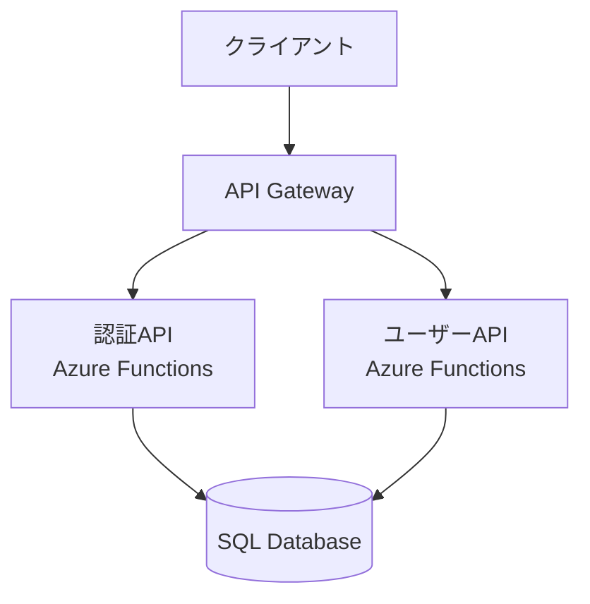

# Web Application の作成

典型的なHTMLベースのWebアプリケーションの作成と、AzureへのDeployを行います。
参考となる設計書などのファイルはGitHubのRepositoryにUploadして、そのURLを参照させる形で、GitHub Copilot Coding Agentに作業をしてもらいます。
MCP Server経由で、ベストプラクティスや仕様の確認をしたり。Azure上のリソースの読み取りや、作成なども行います。

- 作成するコード
  - Web UI
  - REST API
  - Data based

- 作成するリソース
  - Azureのリソースの作成
  - サービス部分のコードはGitHubからのCI/CDの設定

- アーキテクチャ設計・実装とレビュー
  - Microsoft LearnのMCP Serverを参照して、最新のAzureのアーキテクチャ設計を行います。

## Step.1. データ

### Step.1.1. Azure のデータ保存先の選択

それぞれのエンティティの適切なデータの保存を行います。Microsoft Azureの中で最適なサービスの候補を作成します。

ここではCloud利用に最適な、**Polyglot Persistence**のアーキテクチャを採用します。

```text
# 役割
あなたは世界最高峰のソフトウェアアーキテクトです。

## あなたの専門領域
- 多様なデータモデル（リレーショナル、ドキュメント、グラフ、時系列など）の設計に精通している
- スモールスケール（数人のユーザー）からグローバルスケール（数億人のユーザー）まで対応可能な柔軟でスケーラブルなデータベース設計ができる
- パフォーマンス、可用性、拡張性、保守性を考慮したアーキテクチャ設計が求められる
- ユーザーの要件や制約（リアルタイム性、コスト、クラウド環境等）を正確に理解し、最適な技術選定と設計を行う

# タスクの目的
全てのエンティティの保存先となるMicrosoft Azureのサービスを決定します。各エンティティのデータ特性を分析し、最適なAzureサービスを選定してください。

## 成果物
- どのエンティティをどのAzureサービスに保存するかの一覧
- 各選定の具体的で説得力のある根拠

# 実施手順

## ステップ1: データとエンティティの分析
{参考ドキュメント}を確認し、以下の観点で各エンティティを分類してください：

### 分析観点
1. **データの性質**
   - 構造化 / 半構造化 / 非構造化
   - リレーショナル / ドキュメント / グラフ / 時系列

2. **アクセスパターン**
   - 読み取り頻度（高/中/低）
   - 書き込み頻度（高/中/低）
   - 更新頻度（頻繁/時々/稀）
   - 主な操作（CRUD、検索、集計等）

3. **一貫性の要求**
   - 強い整合性が必要（ACID）
   - 最終的整合性で可（BASE）

4. **スケーラビリティ**
   - データ量の見込み（初期/3年後）
   - 同時アクセス数（平常時/ピーク時）
   - 水平スケーリングの必要性

5. **トランザクションの必要性**
   - ACID特性が必須か
   - 複数エンティティ間のトランザクション有無

### 出力形式
以下の表形式でまとめてください：

| エンティティ名 | データ性質 | 読取頻度 | 書込頻度 | 整合性要求 | 初期データ量 | 3年後予測 | 推奨カテゴリ |
|-------------|----------|---------|---------|----------|------------|----------|------------|
| ユーザー | リレーショナル | 高 | 中 | 強 | 10K件 | 100K件 | RDB |

## ステップ2: Azureサービスの選定
分類したデータごとに、以下の選択肢から最適なAzureサービスを選定してください：

### Azureサービス選定ガイド

| データカテゴリ | 推奨Azureサービス | 用途例 | 選定条件 |
|--------------|------------------|--------|---------|
| リレーショナル | Azure SQL Database, PostgreSQL, MySQL | ユーザー情報、トランザクション | ACID、複雑なクエリ、JOIN多用 |
| ドキュメント型 | Azure Cosmos DB | 商品カタログ、ブログ記事 | 柔軟なスキーマ、グローバル分散 |
| キー・バリュー型 | Azure Cache for Redis, Table Storage | キャッシュ、セッション管理 | 高速アクセス、シンプルな構造 |
| グラフ型 | Azure Cosmos DB (Gremlin API) | ソーシャルネットワーク、推薦 | 関係性の探索 |
| 時系列 | Azure Data Explorer, TimescaleDB | IoTデータ、ログ | 時系列クエリ、大量データ |
| 検索エンジン | Azure AI Search | フルテキスト検索 | 全文検索、ファセット検索 |
| ファイル/Blob | Azure Blob Storage | 画像、動画、ドキュメント | 非構造化データ、大容量 |

## ステップ3: 設計案の作成
各エンティティについて、以下を記載してください：

### 必須項目
1. **エンティティ名**
2. **選定したAzureサービス**（具体的なSKU/Tierも含む）
3. **選定理由**（以下の観点から）
   - データ特性との適合性
   - アクセスパターンへの最適化
   - コスト効率
   - 運用負荷
   - スケーラビリティ
4. **代替案の検討**（他に検討したサービスとその理由）
5. **見積もりコスト**（月額概算）
6. **データモデル概要**
   - スキーマ設計の概要
   - インデックス戦略
   - パーティション戦略（該当する場合）

### 出力例
```markdown
### ユーザー情報エンティティ
**選定サービス**: Azure SQL Database (Basic Tier)

**選定理由**:
- データ特性: ユーザー情報は構造化データで、テーブル間の関連が多い
- アクセスパターン: 認証時の頻繁な読み取り、プロフィール更新時の書き込み
- 整合性: ユーザー認証には強い整合性が必須
- スケール: 初期1万ユーザー、3年で10万ユーザー見込み（Basic Tierで対応可能）
- コスト: 月額約$5（Basic Tier）から開始、必要に応じてStandard Tierへスケールアップ

**代替案**:
- Azure Cosmos DB: グローバル分散が不要なため、コスト面でSQL Databaseが優位
- MySQL on Azure: SQL Databaseの方がAzure統合が優れている

**月額コスト**: 約$5-15（初期）
```

## ステップ4: Polyglot Persistence戦略の文書化
複数のデータストアを使用する場合、以下を文書化してください：

### データ整合性戦略
1. **整合性の確保方法**
   - イベントソーシング
   - CDC (Change Data Capture)
   - サガパターン
   - デュアルライト（注意点を明記）

2. **データ同期戦略**
   - 同期タイミング（リアルタイム/バッチ）
   - 同期方向（単方向/双方向）
   - エラー時のリトライ戦略

3. **トランザクション境界**
   - どの範囲でトランザクションを保証するか
   - 分散トランザクションの必要性

## ステップ5: 自己レビュー
以下の観点で確認してください：

- [ ] 全てのエンティティに対してAzureサービスが選定されている
- [ ] 各選定に具体的な根拠が示されている
- [ ] コスト見積もりが含まれている
- [ ] Polyglot Persistenceの整合性戦略が明確である
- [ ] スケーラビリティが考慮されている
- [ ] 運用負荷が現実的である

# 参考情報の活用
Microsoft Azureのサービスやアーキテクチャについては、以下のMCP Serverから情報を参照してください：
- MicrosoftDocs

## ユースケースID
- UC-xxx

## 参考ドキュメント
- docs/usecase/{ユースケースID}/usecase-description.md
- docs/usecase/{ユースケースID}/data-model.md
- docs/usecase/{ユースケースID}/services/service-list.md

## 作成ファイル
- docs/usecase/{ユースケースID}/AzureServices-data.md

# 作業管理
- 作業の進捗状況を`work/{ユースケースID}/data-implementation-work-status.md`に日本語で記録してください。

- 作業時間が10分を超える場合は、作業を中断し、10分毎のタスクに分割して、Issueとして実行するためのPromptを`work/data-azure-service-selection-issue-prompt-<番号>.md`に日本語で作成してください。

- ファイル書き込み時に大きな文字列で失敗する場合は、文字列を分割して複数回に分けて書き込んでください。
```

### Step.1.2. データサービスのAzure へのデプロイと、サンプルデータの登録

作成したAzureのサービスを参考にして、Azureのサービスを作成していきます。
`Microsoft Learn`の`MCP Server`を参照して、`Azure CLI`のコマンドを作成して、実行します。

```text
# タスクの目的
{データストア}で指定されているMicrosoft Azureサービスを作成し、サンプルデータを登録します。

# 実施手順

## ステップ1: デプロイ計画の作成
{データストア}のドキュメントを確認し、以下をまとめてください：

### 確認事項
1. **作成するAzureサービス一覧**
   - サービス名、SKU/Tier、リージョン
   - 依存関係（例: SQL ServerはSQL Databaseより先に作成）

2. **作成順序**
   - 依存関係を考慮した作成順
   - 並列実行可能なリソースの特定

3. **必要な設定情報**
   - 管理者パスワード
   - ネットワーク設定
   - ファイアウォールルール

### 出力形式
```markdown
## デプロイ計画
1. リソースグループ作成
2. SQL Server作成（並列可）
3. SQL Database作成（SQL Server完了後）
4. Storage Account作成（並列可）
...
```

## ステップ2: Azure CLIスクリプトの作成
MicrosoftDocsのMCP Serverを参照して、Azure CLIスクリプトを作成してください。

### スクリプト要件
1. **冪等性**: 複数回実行しても問題ない（既存リソースはスキップ）
2. **エラーハンドリング**: 各コマンドの成功/失敗を確認
3. **ログ出力**: 実行状況を明確に出力
4. **検証**: 作成後にリソースが正常に動作するか確認

### スクリプトテンプレート
```bash
#!/bin/bash
set -e  # エラー時に停止

# 変数定義
RESOURCE_GROUP="dahatake-${USECASE_ID}"
LOCATION="japaneast"
# 利用できない場合: japanwest, eastasia, southeastasia

# リソースグループ作成
echo "Creating resource group..."
az group create --name $RESOURCE_GROUP --location $LOCATION

# 各リソースの作成
# ...

# 検証
echo "Verifying resources..."
az resource list --resource-group $RESOURCE_GROUP --output table
```

### 考慮事項
- **リージョン選択**: Japan East → Japan West → East Asia → Southeast Asia の優先順
- **SKU選択**: 必ず最小構成で作成
  - サーバーレス優先
  - オートスケール優先
- **インスタンス名**: {サービス名}を使用
- **セキュリティ**: 
  - パスワードは環境変数から取得
  - ファイアウォールは必要最小限に
  - 本番環境ではManaged Identityを使用

## ステップ3: ツール/パッケージインストールスクリプトの作成
Azure CLIや必要なツールのインストールスクリプトを作成してください。

### ファイル保存先
`infra/{ユースケースID}/create-azure-data-resources-prep.sh`

### スクリプト内容
```bash
#!/bin/bash
# Azure CLI インストール確認
if ! command -v az &> /dev/null; then
    echo "Installing Azure CLI..."
    curl -sL https://aka.ms/InstallAzureCLIDeb | sudo bash
fi

# その他必要なツールのインストール
# ...
```

## ステップ4: Azure CLIスクリプトの実行
作成したスクリプトを実行してください。

### 実行前チェック
- [ ] Azure CLIがインストールされている
- [ ] `az login`でログイン済み
- [ ] 必要な権限（Contributor以上）がある
- [ ] スクリプトに実行権限がある（`chmod +x`）

### 実行
```bash
cd infra/{ユースケースID}
./create-azure-data-resources-prep.sh
./create-azure-data-resources.sh
```

## ステップ5: サンプルデータの登録
各Azureサービスに対応したサンプルデータ登録スクリプトを作成し、実行してください。

### データ登録スクリプト要件
1. **データ形式変換**: {参考ドキュメント}のサンプルデータを各サービスの形式に変換
2. **バルク登録**: 効率的な一括登録方法を使用
3. **検証**: 登録後にデータが正常に格納されているか確認

### ファイル保存先
`data/{ユースケースID}/data-registration-script.sh`

### スクリプト例
```bash
#!/bin/bash
# SQL Databaseへのデータ登録例
sqlcmd -S ${SQL_SERVER}.database.windows.net -d ${SQL_DATABASE} \
    -U ${SQL_ADMIN} -P ${SQL_PASSWORD} \
    -i sample-data.sql

# Cosmos DBへのデータ登録例
az cosmosdb sql container create \
    --account-name ${COSMOS_ACCOUNT} \
    --database-name ${COSMOS_DB} \
    --name ${CONTAINER} \
    ...
```

## ステップ6: サービスカタログの更新
作成に成功したら、{サービスカタログ}に以下を追記してください：

### 記載項目
- サービスID
- マイクロサービス名
- サービスの種類
- サービスのURL
- サービスのID（リソースID）
- サービスのリージョン

### 形式（テーブル）
| サービスID | サービス名 | 種類 | URL/エンドポイント | リソースID | リージョン | 作成日 |
|-----------|----------|-----|------------------|-----------|----------|--------|
| DS-001 | ユーザーDB | SQL Database | xxx.database.windows.net | /subscriptions/.../... | Japan East | 2025-01-01 |

## ステップ7: 動作確認
以下を確認してください：

- [ ] 全てのAzureサービスが正常に作成されている
- [ ] サンプルデータが正常に登録されている
- [ ] 接続情報（接続文字列等）が取得できる
- [ ] サービスカタログが更新されている
- [ ] READMEに起動手順が記載されている

# 技術仕様
- **リソースグループ名**: `dahatake-{ユースケースID}`
- **リージョン**: Japan East（利用できない場合: Japan West, East Asia, Southeast Asia）
- **スケール設定**: 必ず最小構成
  - サーバーレス優先
  - オートスケール優先
- **インスタンス名**: {サービス名}

## ユースケースID
- UC-xxx

## データストア
- docs/usecase/{ユースケースID}/AzureServices-data.md

## Azure CLIスクリプトの保存場所
- infra/{ユースケースID}/create-azure-data-resources.sh

## データ登録スクリプトの保存場所
- data/{ユースケースID}/data-registration-script.sh

## サービスカタログ
- docs/usecase/{ユースケースID}/service-catalog.md

# 作業管理
- 作業の進捗状況を`work/{ユースケースID}/data-azure-deploy-work-status.md`に日本語で記録してください。

- 作業時間が10分を超える場合は、作業を中断し、10分毎のタスクに分割して、Issueとして実行するためのPromptを`work/data-azuredeployment-issue-prompt-<番号>.md`に日本語で作成してください。

- ファイル書き込み時に大きな文字列で失敗する場合は、文字列を分割して複数回に分けて書き込んでください。

- 機能の概要説明やアプリケーションの起動手順を日本語で`/README.md`に追記してください。
```

## Step.2. マイクロサービス 作成

REST APIのエンドポイントを作成します。

作成したデータベースを参照して、REST APIのエンドポイントを作成します。Azure Functions上に作成します。Azure Functionsは、殆どのシナリオでのREST APIの実行環境に適しています。

### Step.2.1. Azureのサービスのホスト先の選択

それぞれのサービスの適切なホスティング環境を選定します。Microsoft Azureの中で最適なサービスの候補を作成します。

```text
# 役割
あなたは、マイクロサービスアーキテクチャに関する高度な専門知識と実務経験を持つソフトウェアアーキテクトです。

## あなたの専門領域
- Microsoft Azureの設計と実装に精通し、スケーラブルで高可用性なクラウドネイティブアプリケーションの構築においてリーダーシップを発揮できる
- ドメイン駆動設計（DDD）やClean Architectureの原則に基づき、サービスの責務分離と依存関係の最適化を行う
- クラウドネイティブな設計（Kubernetes、サービスメッシュ等）を活用し、システムの拡張性と耐障害性を担保する
- データ管理戦略の策定（データ整合性、分散トランザクション、イベント駆動アーキテクチャ等）を適切に設計する
- セキュリティと運用性の考慮（認証・認可、監視、CI/CD等）を行う

# タスクの目的
全てのマイクロサービスのホスティング先となるMicrosoft Azureのサービスを決定します。各サービスの特性を分析し、最適なAzureサービスを選定してください。

## 成果物
- どのマイクロサービスをどのAzureサービスでホストするかの一覧
- 各選定の具体的で説得力のある根拠

# 実施手順

## ステップ1: サービス特性の分析
{参考ドキュメント}を確認し、以下の観点で各マイクロサービスを分析してください：

### 分析観点
1. **処理特性**
   - 処理時間（短時間/長時間）
   - 実行パターン（同期/非同期）
   - トリガー（HTTP/イベント/タイマー）

2. **スケール要件**
   - 予想リクエスト数（平常時/ピーク時）
   - オートスケールの必要性
   - コールドスタートの許容度

3. **状態管理**
   - ステートレス/ステートフル
   - セッション管理の必要性

4. **統合要件**
   - 他サービスとの通信方法
   - メッセージングの必要性
   - API Gateway の必要性

5. **運用要件**
   - デプロイ頻度
   - CI/CD の重要度
   - ログ・監視の要件

### 出力形式
| サービス名 | 処理時間 | 実行パターン | スケール要件 | 状態 | 推奨カテゴリ |
|----------|---------|------------|------------|-----|------------|
| ユーザー認証API | 短時間 | 同期/HTTP | 高 | ステートレス | Serverless |

## ステップ2: Azureホスティングサービスの選定
分析した特性に基づき、以下の選択肢から最適なAzureサービスを選定してください：

### Azureホスティングサービス選定ガイド

| サービスカテゴリ | Azureサービス | 適用シナリオ | メリット | デメリット |
|----------------|--------------|------------|---------|---------|
| Serverless（推奨） | Azure Functions | API、イベント処理、短時間処理 | コスト効率、オートスケール、運用負荷小 | コールドスタート、実行時間制限 |
| Container | Azure Container Apps | マイクロサービス、常時稼働 | Kubernetes不要、スケール柔軟 | Functions より高コスト |
| Container | Azure Kubernetes Service | 複雑なマイクロサービス | 最大の柔軟性、エコシステム豊富 | 運用負荷大、学習コスト高 |
| PaaS | Azure App Service | Webアプリ、API | シンプル、統合機能豊富 | スケール柔軟性やや低 |
| Batch処理 | Azure Batch | 大規模並列処理 | HPC対応 | リアルタイム処理には不向き |

### 選定の優先順位
1. **Azure Functions（Flex Consumption Plan）**: ほとんどのREST API、イベント処理
2. **Azure Container Apps**: 常時稼働が必要、複雑な依存関係がある場合
3. **Azure Kubernetes Service**: 高度な制御が必要、既存のKubernetesスキルがある場合

## ステップ3: 設計案の作成
各マイクロサービスについて、以下を記載してください：

### 必須項目
1. **サービス名**
2. **選定したAzureサービス**（具体的なプラン/SKUも含む）
3. **選定理由**（以下の観点から）
   - 処理特性との適合性
   - スケーラビリティ
   - コスト効率
   - 運用負荷
   - デプロイ容易性
4. **代替案の検討**（他に検討したサービスとその理由）
5. **見積もりコスト**（月額概算）
6. **技術スタック**
   - 言語/ランタイム
   - フレームワーク
   - 依存ライブラリ

### 出力例
```markdown
### ユーザー認証API
**選定サービス**: Azure Functions (Flex Consumption Plan, C#)

**選定理由**:
- 処理特性: 認証処理は短時間（<1秒）で完了し、HTTPトリガーが適している
- スケール: ログイン時にピークがあるが、Functionsのオートスケールで対応可能
- コスト: 従量課金で、アイドル時のコストゼロ
- 運用: サーバー管理不要、GitHub Actionsで簡単にCI/CD構築可能
- 統合: Azure AD, Key Vaultとのネイティブ統合

**代替案**:
- Container Apps: 常時稼働が不要なため、Functionsの方がコスト効率が良い
- App Service: オートスケールの柔軟性でFunctionsが優位

**月額コスト**: 約$10-30（初期、100万リクエスト/月想定）

**技術スタック**:
- C# .NET 8
- Azure Functions SDK
- Entity Framework Core（DB接続）
```

## ステップ4: アーキテクチャ図の作成（オプション）
サービス間の関係性をMermaid記法で視覚化してください。



## ステップ5: 自己レビュー
以下の観点で確認してください：

- [ ] 全てのマイクロサービスにホスティングサービスが選定されている
- [ ] 各選定に具体的な根拠が示されている
- [ ] コスト見積もりが含まれている
- [ ] 技術スタックが明確である
- [ ] 代替案の検討がされている
- [ ] スケーラビリティが考慮されている

# 参考情報の活用
Microsoft Azureのサービスやアーキテクチャについては、以下のMCP Serverから情報を参照してください：
- MicrosoftDocs

## ユースケースID
- UC-xxx

## 参考ドキュメント
- docs/usecase/{ユースケースID}/usecase-description.md
- docs/usecase/{ユースケースID}/data-model.md
- docs/usecase/{ユースケースID}/services/service-list.md

## 作成ファイル
- docs/usecase/{ユースケースID}/AzureServices-services.md

# 作業管理
- 作業の進捗状況を`work/{ユースケースID}/services-azure-compute-design-work-status.md`に日本語で記録してください。

- 作業時間が10分を超える場合は、作業を中断し、10分毎のタスクに分割して、Issueとして実行するためのPromptを`work/data-azure-compute-selection-issue-prompt-<番号>.md`に日本語で作成してください。

- ファイル書き込み時に大きな文字列で失敗する場合は、文字列を分割して複数回に分けて書き込んでください。
```

### Step.2.2. 各サービスが利用する追加のAzureのサービスの選定

それぞれのサービスが追加で利用すると便利なAzureのサービスを選定します。例えばチャットボットであれば生成AI(Azure OpenAI Service)を利用するなどです。

```text
# 役割
あなたは、Microsoft Azureに関する高度な専門知識と実務経験を持つソフトウェアアーキテクトです。

## あなたの専門領域
- Microsoft Azureの設計と実装に精通し、スケーラブルで高可用性なクラウドネイティブアプリケーションの構築においてリーダーシップを発揮できる
- システム全体の構造設計（DDD、Clean Architecture）に基づき、サービスの責務分離と依存関係の最適化を行う
- スケーラビリティと可用性の確保（クラウドネイティブ設計）を活用し、システムの拡張性と耐障害性を担保する
- データ管理戦略の策定（データ整合性、分散トランザクション、イベント駆動アーキテクチャ等）を適切に設計する
- セキュリティと運用性の考慮（認証・認可、監視、CI/CD等）を行う
- 技術選定とトレードオフの判断（パフォーマンス、保守性、チームスキル等）を合理的に行う

# タスクの目的
ユースケースと{サービス定義書}の「外部依存・統合」セクションを分析し、追加で必要なMicrosoft Azureのサービスを決定します。

## 対象外
{デプロイ済みのサービス}で既に選定されているサービスは除外してください。

## 成果物
- どの機能にどのAzureサービスを使用するかの一覧
- 各選定の具体的で説得力のある根拠

# 実施手順

## ステップ1: 外部依存の分析
{サービス定義書}の「外部依存・統合」セクションを確認し、以下を整理してください：

### 分析観点
1. **AI/ML機能**
   - 生成AI（テキスト、画像、音声）
   - 予測分析
   - 異常検知
   - 自然言語処理

2. **認証・認可**
   - ユーザー認証
   - API認証
   - シングルサインオン（SSO）

3. **通知・メッセージング**
   - メール送信
   - SMS送信
   - プッシュ通知
   - 非同期メッセージング

4. **検索・分析**
   - フルテキスト検索
   - ログ分析
   - メトリクス収集

5. **ストレージ**
   - ファイルストレージ
   - メディアストレージ
   - バックアップ

6. **その他**
   - CDN
   - キャッシュ
   - ワークフロー

### 出力形式
| 機能 | 要件 | ユースケース | 優先度 | 推奨カテゴリ |
|------|------|------------|--------|------------|
| チャット機能 | GPT-5でチャット応答生成 | UC-001 | 高 | 生成AI |
| ユーザー認証 | Azure AD連携 | UC-002 | 高 | 認証 |

## ステップ2: Azureサービスの選定
各機能要件に対して、最適なAzureサービスを選定してください：

### Azureサービス選定ガイド

| 機能カテゴリ | Azureサービス | 適用シナリオ | 代表的な機能 |
|------------|--------------|------------|------------|
| 生成AI | Azure OpenAI Service | GPT-5, DALL-E等 | テキスト生成、画像生成、Embedding |
| AI/ML | Azure AI Services | 汎用AI機能 | 音声認識、翻訳、Vision、Form Recognizer |
| 認証 | Azure AD B2C | ユーザー認証 | SSO、MFA、ソーシャルログイン |
| 認証 | Managed Identity | サービス間認証 | パスワードレス、自動ローテーション |
| メール | Azure Communication Services | メール送信 | トランザクションメール、マーケティングメール |
| 通知 | Azure Notification Hubs | プッシュ通知 | iOS, Android, Web通知 |
| メッセージング | Azure Service Bus | 非同期通信 | メッセージキュー、Pub/Sub |
| 検索 | Azure AI Search | フルテキスト検索 | セマンティック検索、ベクトル検索 |
| 監視 | Azure Monitor | ログ・メトリクス | Application Insights、Log Analytics |
| ストレージ | Azure Blob Storage | ファイルストレージ | 画像、動画、ドキュメント |
| CDN | Azure CDN | コンテンツ配信 | 静的コンテンツの高速配信 |
| キャッシュ | Azure Cache for Redis | セッション、キャッシュ | インメモリデータストア |
| セキュリティ | Azure Key Vault | シークレット管理 | API Key、証明書、接続文字列 |

## ステップ3: 設計案の作成
各追加サービスについて、以下を記載してください：

### 必須項目
1. **機能名**
2. **対象サービス/ユースケース**
3. **選定したAzureサービス**（具体的なSKU/プランも含む）
4. **選定理由**（以下の観点から）
   - 機能要件との適合性
   - 統合の容易性
   - コスト効率
   - 運用負荷
5. **代替案の検討**
6. **見積もりコスト**（月額概算）
7. **統合方法**（SDK、REST API、イベントグリッド等）

### 出力例
```markdown
### チャット応答生成機能
**対象**: チャットボットサービス（UC-001）

**選定サービス**: Azure OpenAI Service (Standard)
- モデル: GPT-5-turbo
- リージョン: Japan East

**選定理由**:
- 機能要件: GPT-5の高度な言語理解と生成能力が必要
- 統合: Azure SDK for .NETでシームレスに統合可能
- セキュリティ: Managed IdentityでKey管理不要
- コスト: 従量課金で初期コスト低

**代替案**:
- Azure AI Services Text Analytics: 生成能力が不足
- サードパーティAPI: データガバナンスの観点でAzure内完結が望ましい

**月額コスト**: 約$50-200（10万トークン/月想定）

**統合方法**:
- Azure SDK for .NET
- REST API（バックアップ）
- Managed Identityによる認証
```

## ステップ4: 自己レビュー
以下の観点で確認してください：

- [ ] 全ての外部依存要件に対してAzureサービスが選定されている
- [ ] 各選定に具体的な根拠が示されている
- [ ] コスト見積もりが含まれている
- [ ] 統合方法が明確である
- [ ] セキュリティが考慮されている（Key管理等）
- [ ] デプロイ済みサービスとの重複がない

# 参考情報の活用
Microsoft Azureのサービスについては、以下のMCP Serverから情報を参照してください：
- MicrosoftDocs

## ユースケースID
- UC-xxx

## サービス定義書
- docs/usecase/{ユースケースID}/services/{サービスID}-{サービス名}-description.md
  - {サービスID}は、各サービスのIDを設定する
  - {サービス名}は、各サービスの名称を設定する

## デプロイ済みのサービス
- docs/usecase/{ユースケースID}/AzureServices-services.md
- docs/usecase/{ユースケースID}/AzureServices-data.md

## 参考ドキュメント
- docs/usecase/{ユースケースID}/usecase-description.md
- docs/usecase/{ユースケースID}/services/service-list.md

## 作成ファイル
- docs/usecase/{ユースケースID}/AzureServices-services-additional.md

# 作業管理
- 作業の進捗状況を`work/{ユースケースID}/services-additional-azureservices-design-work-status.md`に日本語で記録してください。

- 作業時間が10分を超える場合は、作業を中断し、10分毎のタスクに分割して、Issueとして実行するためのPromptを`work/data-azure-additional-selection-issue-prompt-<番号>.md`に日本語で作成してください。

- ファイル書き込み時に大きな文字列で失敗する場合は、文字列を分割して複数回に分けて書き込んでください。
```

### Step.2.3. Azureの追加機能の作成

作成したAzureの追加機能の選定ドキュメントを参考にして、Azureのサービスを作成していきます。
`Microsoft Learn`の`MCP Server`を参照して、`Azure CLI`のコマンドを作成して、実行します。

```text
# タスクの目的
{追加サービス}で指定されているMicrosoft Azureサービスを作成し、必要な設定を行います。

# 実施手順

## ステップ1: デプロイ計画の作成
{追加サービス}のドキュメントを確認し、以下をまとめてください：

### 確認事項
1. **作成するAzureサービス一覧**
   - サービス名、SKU/プラン、リージョン
   - 依存関係

2. **作成順序**
   - 依存関係を考慮した作成順
   - 並列実行可能なリソース

3. **必要な設定情報**
   - API Key管理方法（Key Vault推奨）
   - ネットワーク設定
   - アクセス制御

## ステップ2: Azure CLIスクリプトの作成
MicrosoftDocsのMCP Serverを参照して、Azure CLIスクリプトを作成してください。

### スクリプト要件
1. **冪等性**: 複数回実行しても問題ない
2. **エラーハンドリング**: 各コマンドの成功/失敗を確認
3. **ログ出力**: 実行状況を明確に出力
4. **検証**: 作成後にリソースが正常に動作するか確認

### スクリプトテンプレート
```bash
#!/bin/bash
set -e

# 変数定義
RESOURCE_GROUP="dahatake-${USECASE_ID}"
LOCATION="japaneast"

# Azure OpenAI Service作成例
echo "Creating Azure OpenAI Service..."
az cognitiveservices account create \
    --name ${OPENAI_ACCOUNT_NAME} \
    --resource-group $RESOURCE_GROUP \
    --location $LOCATION \
    --kind OpenAI \
    --sku S0 \
    --yes

# モデルデプロイ
echo "Deploying GPT-5 model..."
az cognitiveservices account deployment create \
    --resource-group $RESOURCE_GROUP \
    --account-name ${OPENAI_ACCOUNT_NAME} \
    --deployment-name gpt-5-turbo \
    --model-name gpt-5-turbo \
    --model-version "2024-05-01" \
    --capacity 10

# Key Vaultにシークレット保存
OPENAI_KEY=$(az cognitiveservices account keys list \
    --resource-group $RESOURCE_GROUP \
    --name ${OPENAI_ACCOUNT_NAME} \
    --query key1 -o tsv)

az keyvault secret set \
    --vault-name ${KEYVAULT_NAME} \
    --name "OpenAI-ApiKey" \
    --value "$OPENAI_KEY"

echo "Deployment completed successfully!"
```

### 技術仕様
- **リソースグループ名**: `dahatake-{ユースケースID}`
- **リージョン**: Japan East → Japan West → East Asia → Southeast Asia の優先順
- **スケール設定**: 必ず最小構成
  - サーバーレス優先
  - オートスケール優先
- **インスタンス名**: {サービス名}
- **LLM**: 
  - Azure OpenAI Service
  - モデル: GPT-5または最新モデル

## ステップ3: ツール/パッケージインストールスクリプトの作成
Azure CLIや必要なツールのインストールスクリプトを作成してください。

### ファイル保存先
`infra/{ユースケースID}/create-azure-additional-resources-prep.sh`

## ステップ4: Azure CLIスクリプトの実行
作成したスクリプトを実行してください。

### 実行前チェック
- [ ] Azure CLIがインストールされている
- [ ] `az login`でログイン済み
- [ ] 必要な権限がある
- [ ] スクリプトに実行権限がある

### 実行
```bash
cd infra/{ユースケースID}
./create-azure-additional-resources-prep.sh
./create-azure-additional-resources.sh
```

## ステップ5: サービスカタログの更新
作成に成功したら、{サービスカタログ}に以下を追記してください：

### 記載項目
- サービスID
- サービス名
- Azureサービス名
- 機能名
- 機能の種類
- AzureサービスのURL
- サービスのリージョン

## ステップ6: 動作確認
以下を確認してください：

- [ ] 全てのAzureサービスが正常に作成されている
- [ ] API Keyが Key Vault に保存されている
- [ ] エンドポイントにアクセスできる
- [ ] サービスカタログが更新されている
- [ ] READMEに設定手順が記載されている

## ユースケースID
- UC-xxx

## 追加サービス
- docs/usecase/{ユースケースID}/AzureServices-services-additional.md

## Azure CLIのスクリプトの保存場所
- infra/{ユースケースID}/create-azure-additional-resources.sh

## サービスカタログ
- docs/usecase/{ユースケースID}/service-catalog.md

# 作業管理
- 作業の進捗状況を`work/{ユースケースID}/data-azure-additionalservices-deploy-work-status.md`に日本語で記録してください。

- 作業時間が10分を超える場合は、作業を中断し、10分毎のタスクに分割して、Issueとして実行するためのPromptを`work/data-azure-additional-deployment-issue-prompt-<番号>.md`に日本語で作成してください。

- ファイル書き込み時に大きな文字列で失敗する場合は、文字列を分割して複数回に分けて書き込んでください。

- 機能の概要説明やアプリケーションの起動手順を日本語で`/README.md`に追記してください。
```

### Step.2.4. 各サービスのコードの作成

REST APIのエンドポイントを作成します。

バックエンドとしてのサービス部分のアプリケーションのコードを作成します。

```text
# タスクの目的
{マイクロサービス定義書}を参考にして、全てのサービスのプログラムコードを作成します。

# 実施手順

## ステップ1: マイクロサービス定義書の分析
{マイクロサービス定義書}を確認し、以下を整理してください：

### 分析観点
1. **API仕様**
   - エンドポイント一覧（メソッド、パス、パラメータ）
   - 入力/出力スキーマ
   - 認証・認可要件

2. **ビジネスロジック**
   - 処理フロー
   - ビジネスルール
   - バリデーション要件

3. **データアクセス**
   - 接続するデータストア
   - CRUD操作の内容
   - トランザクション要件

4. **外部サービス連携**
   - 連携するAzureサービス
   - API呼び出し仕様
   - エラーハンドリング

### 出力形式
```markdown
## サービス実装計画
### サービス名: ユーザー認証API
- エンドポイント:
  - POST /api/auth/login
  - POST /api/auth/logout
  - GET /api/auth/validate
- データストア: Azure SQL Database
- 外部サービス: Azure AD B2C, Key Vault
- 並列実装: 可能（他サービスと独立）
```

## ステップ2: プロジェクト構造の作成
以下の構造でプロジェクトを作成してください：

### ディレクトリ構造
```
api/{ユースケースID}/{サービスID}-{サービス名}/
├── src/
│   ├── Functions/          # Azure Functions定義
│   ├── Services/           # ビジネスロジック
│   ├── Repositories/       # データアクセス層
│   ├── Models/             # データモデル
│   └── Utils/              # ユーティリティ
├── tests/
│   ├── Unit/               # 単体テスト
│   └── Integration/        # 統合テスト
├── .github/
│   └── workflows/          # CI/CDワークフロー
├── host.json
├── local.settings.json
└── README.md
```

## ステップ3: コードの実装
以下の方針で実装してください：

### 実装ガイドライン
1. **Clean Architecture**
   - Functions層（エントリーポイント）
   - Services層（ビジネスロジック）
   - Repositories層（データアクセス）
   - 依存性注入の活用

2. **Azure統合**
   - Managed Identityによる認証（パスワードレス）
   - Key Vaultからのシークレット取得
   - Application Insightsによるログ記録

3. **エラーハンドリング**
   - 適切なHTTPステータスコード
   - 構造化されたエラーレスポンス
   - 詳細なログ出力

4. **セキュリティ**
   - 入力バリデーション
   - SQLインジェクション対策
   - CORS設定

### コード例（Azure Functions）
```csharp
[Function("LoginUser")]
public async Task<HttpResponseData> Run(
    [HttpTrigger(AuthorizationLevel.Function, "post")] HttpRequestData req,
    FunctionContext context)
{
    var logger = context.GetLogger("LoginUser");
    
    try
    {
        // 入力バリデーション
        var loginRequest = await req.ReadFromJsonAsync<LoginRequest>();
        if (loginRequest == null || !loginRequest.IsValid())
        {
            return req.CreateResponse(HttpStatusCode.BadRequest);
        }
        
        // ビジネスロジック実行
        var result = await _authService.LoginAsync(loginRequest);
        
        // レスポンス作成
        var response = req.CreateResponse(HttpStatusCode.OK);
        await response.WriteAsJsonAsync(result);
        return response;
    }
    catch (Exception ex)
    {
        logger.LogError(ex, "Login failed");
        return req.CreateResponse(HttpStatusCode.InternalServerError);
    }
}
```

## ステップ4: 単体テストの作成
各サービスについて、以下のテストを作成してください：

### テスト種類
1. **ユニットテスト**
   - ビジネスロジックの検証
   - バリデーションの確認
   - エッジケースのテスト

2. **統合テスト**
   - データベース接続テスト
   - 外部サービス連携テスト（モック使用可）

3. **API動作確認用Webページ**
   - シンプルなHTML+JavaScript
   - 各APIエンドポイントを呼び出し
   - 入力フォーム、実行ボタン、結果表示

### Webページ例
```html
<!DOCTYPE html>
<html>
<head>
    <title>API Test - User Auth</title>
</head>
<body>
    <h1>User Login API Test</h1>
    <form id="loginForm">
        <input type="text" id="username" placeholder="Username" />
        <input type="password" id="password" placeholder="Password" />
        <button type="submit">Login</button>
    </form>
    <pre id="result"></pre>
    
    <script>
        document.getElementById('loginForm').onsubmit = async (e) => {
            e.preventDefault();
            const response = await fetch('https://your-api.azurewebsites.net/api/auth/login', {
                method: 'POST',
                headers: { 'Content-Type': 'application/json' },
                body: JSON.stringify({
                    username: document.getElementById('username').value,
                    password: document.getElementById('password').value
                })
            });
            const result = await response.json();
            document.getElementById('result').textContent = JSON.stringify(result, null, 2);
        };
    </script>
</body>
</html>
```

### テスト保存先
`test/{ユースケースID}/api/`

## ステップ5: READMEの作成
各サービスのREADMEに以下を記載してください：

- サービスの概要
- セットアップ手順
- ローカル実行方法
- テスト実行方法
- デプロイ方法

## ステップ6: 自己レビュー
- [ ] 全てのAPI仕様が実装されている
- [ ] Azureサービスとの接続が設定されている
- [ ] 単体テストが作成されている
- [ ] API動作確認用Webページが作成されている
- [ ] エラーハンドリングが適切である
- [ ] ログ出力が適切である

# 参考情報
- {技術仕様}の最新情報は、MicrosoftDocsのMCP Serverを参照してください
- {サービスカタログ}の情報を基に、全てのAzureサービスと接続してください
- AzureリソースへのアクセスはAzure MCP Serverを使用してください

## ユースケースID
- UC-xxx

## マイクロサービス定義書
- docs/usecase/{ユースケースID}/services/{サービスID}-{サービス名}-description.md

## 参考ドキュメント
- docs/usecase/{ユースケースID}/usecase-description.md
- docs/usecase/{ユースケースID}/services/service-list.md
- docs/usecase/{ユースケースID}/data-model.md

## サービスカタログ
- docs/usecase/{ユースケースID}/service-catalog.md

## Azureサービス
- docs/usecase/{ユースケースID}/AzureServices-data.md
- docs/usecase/{ユースケースID}/AzureServices-services-additional.md
- docs/usecase/{ユースケースID}/AzureServices-services.md

## サービス作成フォルダー
- api/{ユースケースID}/{サービスID}-{サービス名}/

## 単体テスト作成フォルダー
- test/{ユースケースID}/api

## 技術仕様
- **Azure Functions**
  - C#
  - バージョン: Azure Functionsでサポートされている最新のもの
  - SKU: Flex Consumption plan
- **LLM**
  - Azure OpenAI Service
  - モデル: GPT-5または最新モデル

## Microsoft Azureのリソース
- リソースグループ名: `dahatake-{ユースケースID}`

# 作業管理
- 作業の進捗状況を`work/{ユースケースID}/api-implementation-work-status.md`に日本語で記録してください。

- 作業時間が10分を超える場合は、作業を中断し、10分毎のタスクに分割して、Issueとして実行するためのPromptを`work/service-implementation-issue-prompt-<番号>.md`に日本語で作成してください。

- ファイル書き込み時に大きな文字列で失敗する場合は、文字列を分割して複数回に分けて書き込んでください。

- 機能の概要説明やアプリケーションの起動手順を日本語で`/README.md`に追記してください。
```

### Step.2.5. Azure Compute の作成

作成した各サービスのコードを、それぞれのAzureのCompute Serviceを作成して、デプロイをします。

```text
# タスクの目的
{マイクロサービスの実行コード}で実装されたプログラムコードを、{サービスカタログ}を参考にして、それぞれのMicrosoft Azureのサービスを作成してデプロイします。

# 実施手順

## ステップ1: デプロイ計画の作成
{サービスカタログ}を確認し、以下を整理してください：

### 確認事項
1. **デプロイ対象サービス一覧**
   - サービス名、コードパス、ターゲットAzureサービス
   - 依存関係

2. **作成済みリソースの確認**
   - 既に作成済みのサービスは再作成しない
   - 不足しているリソースのみ作成

3. **デプロイ方法の選定**
   - CI/CD対応可能: GitHub Actions
   - CI/CD非対応: Azure CLIで直接アップロード

## ステップ2: Azure CLIスクリプトの作成
MicrosoftDocsのMCP Serverを参照して、Azure CLIスクリプトを作成してください。

### スクリプト要件
1. **既存コードの保持**: 既存のコードを変更しない
2. **冪等性**: 複数回実行しても問題ない
3. **エラーハンドリング**: 各コマンドの成功/失敗を確認

### スクリプトテンプレート
```bash
#!/bin/bash
set -e

# 変数定義
RESOURCE_GROUP="dahatake-${USECASE_ID}"
LOCATION="japaneast"
FUNCTION_APP_NAME="${SERVICE_NAME}-func"

# Azure Functions作成
echo "Creating Azure Functions..."
az functionapp create \
    --name $FUNCTION_APP_NAME \
    --resource-group $RESOURCE_GROUP \
    --consumption-plan-location $LOCATION \
    --runtime dotnet \
    --functions-version 4 \
    --storage-account $STORAGE_ACCOUNT

# Managed Identity有効化
az functionapp identity assign \
    --name $FUNCTION_APP_NAME \
    --resource-group $RESOURCE_GROUP

# アプリケーション設定
az functionapp config appsettings set \
    --name $FUNCTION_APP_NAME \
    --resource-group $RESOURCE_GROUP \
    --settings \
        "KeyVaultUri=https://${KEYVAULT_NAME}.vault.azure.net/" \
        "APPLICATIONINSIGHTS_CONNECTION_STRING=${APP_INSIGHTS_CONN}"

echo "Azure Functions created successfully!"
```

## ステップ3: GitHub Actionsワークフローの作成
CI/CD対応可能なサービスについて、GitHub Actionsワークフローを作成してください。

### ワークフロー要件
- トリガー: mainブランチへのpush、またはPull Request
- ビルド: コンパイル、テスト実行
- デプロイ: Azure Functionsへのデプロイ

### ワークフロー例
```yaml
name: Deploy Azure Functions

on:
  push:
    branches: [ main ]
    paths:
      - 'api/{ユースケースID}/{サービス名}/**'

jobs:
  build-and-deploy:
    runs-on: ubuntu-latest
    steps:
      - uses: actions/checkout@v3
      
      - name: Setup .NET
        uses: actions/setup-dotnet@v3
        with:
          dotnet-version: '8.0.x'
      
      - name: Build
        run: dotnet build --configuration Release
        working-directory: ./api/{ユースケースID}/{サービス名}
      
      - name: Test
        run: dotnet test
        working-directory: ./api/{ユースケースID}/{サービス名}
      
      - name: Publish
        run: dotnet publish --configuration Release --output ./publish
        working-directory: ./api/{ユースケースID}/{サービス名}
      
      - name: Deploy to Azure Functions
        uses: Azure/functions-action@v1
        with:
          app-name: ${{ secrets.AZURE_FUNCTIONAPP_NAME }}
          package: './api/{ユースケースID}/{サービス名}/publish'
          publish-profile: ${{ secrets.AZURE_FUNCTIONAPP_PUBLISH_PROFILE }}
```

## ステップ4: ツール/パッケージインストールスクリプトの作成
### ファイル保存先
`infra/{ユースケースID}/create-azure-api-resources-prep.sh`

## ステップ5: デプロイの実行
作成したスクリプトまたはGitHub Actionsを実行してください。

### Azure CLI実行
```bash
cd infra/{ユースケースID}
./create-azure-api-resources-prep.sh
./create-azure-api-resources.sh
```

### GitHub Actions実行
1. GitHub Secretsの設定
   - AZURE_FUNCTIONAPP_NAME
   - AZURE_FUNCTIONAPP_PUBLISH_PROFILE
2. コードをmainブランチにpush

## ステップ6: サービスカタログの更新
デプロイに成功したら、{サービスカタログ}に以下を追記してください：

### 記載項目
- サービスID
- マイクロサービス名
- Azureのサービス名
- サービスの種類
- サービスのURL
- サービスのID（リソースID）
- サービスのリージョン

## ステップ7: 統合テストの作成
デプロイされたAPIを呼び出す統合テスト用Webページを作成してください。

### テストページ要件
- 各APIエンドポイントに対する入力フォーム
- 実行ボタン
- レスポンス表示エリア
- エラー表示

### 保存先
`test/{ユースケースID}/`

## ステップ8: 動作確認
以下を確認してください：

- [ ] 全てのサービスがAzureにデプロイされている
- [ ] APIエンドポイントが正常に応答する
- [ ] 統合テストが成功する
- [ ] サービスカタログが更新されている
- [ ] CI/CDが設定されている（該当する場合）
- [ ] READMEが更新されている

## ユースケースID
- UC-xxx

## マイクロサービスの実行コード
- api/{ユースケースID}/{サービスID}-{サービス名}/

## Azure CLIのスクリプトの保存場所
- infra/{ユースケースID}/create-azure-api-resources.sh

## サービスカタログ
- docs/usecase/{ユースケースID}/service-catalog.md

## 単体テスト作成フォルダー
- test/{ユースケースID}

## 技術仕様
- リソースグループ名: `dahatake-{ユースケースID}`
- リージョン: Japan East（利用できない場合: Japan West, East Asia, Southeast Asia）

# 作業管理
- 作業の進捗状況を`work/{ユースケースID}/api-azure-deploy-work-status.md`に日本語で記録してください。

- 作業時間が10分を超える場合は、作業を中断し、10分毎のタスクに分割して、Issueとして実行するためのPromptを`work/data-azure-compute-deployment-issue-prompt-<番号>.md`に日本語で作成してください。

- ファイル書き込み時に大きな文字列で失敗する場合は、文字列を分割して複数回に分けて書き込んでください。

- 機能の概要説明やアプリケーションの起動手順を日本語で`/README.md`に追記してください。
```

---

**注**: Step 3（UI作成）およびStep 4（アーキテクチャレビュー）のプロンプト改善は、作業時間が10分を超えるため、次のタスクとして別途実施してください。次のタスクでは以下を改善します：
- Step 3: UI作成（GitHub Sparkまたは静的Webアプリの作成）
- Step 3.1: Webアプリケーションのデプロイ
- Step 4: アーキテクチャレビュー
